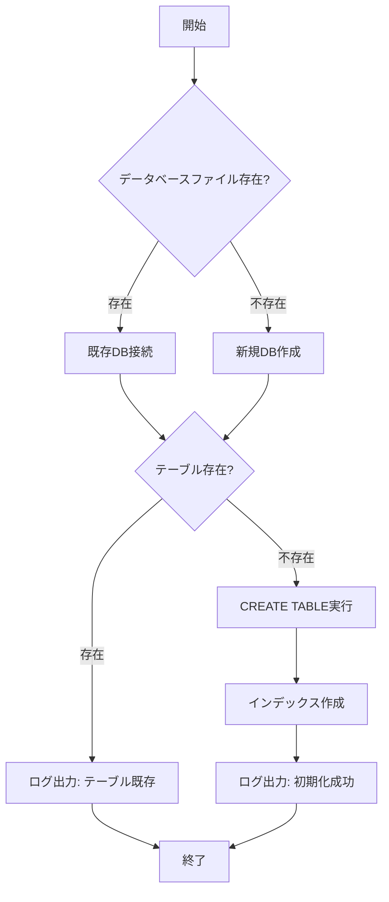

# 詳細設計書

## ドキュメント情報

| 項目 | 内容 |
|-----|------|
| ドキュメント名 | 社員情報管理システム 詳細設計書 |
| 版数 | 1.0 |
| 作成日 | 2026-03-22 |
| 対象システム | 社員情報管理システム（Python学習用） |

**注記**: 本ドキュメントでは D-01～D-04, D-10 を記載。D-05～D-09 は「詳細設計書_続き.md」を参照。

---

## D-01: データベース初期化機能

### 概要
SQLiteデータベースとemployeesテーブルを初期化する機能

### クラス名
`DatabaseManager`

### ファイルパス
`database/database_manager.py`

### 処理フロー



### 実装コード例

```python
# database/database_manager.py
import sqlite3
import logging
from pathlib import Path

class DatabaseManager:
    """データベース管理クラス"""
    
    def __init__(self, db_path='database/employees.db'):
        """
        コンストラクタ
        
        Args:
            db_path (str): データベースファイルパス
        """
        self.db_path = db_path
        self.logger = logging.getLogger(__name__)
        
    def initialize_database(self):
        """
        データベースとテーブルを初期化
        
        Returns:
            bool: 成功時True、失敗時False
        """
        try:
            # データベースディレクトリが存在しない場合は作成
            db_dir = Path(self.db_path).parent
            db_dir.mkdir(parents=True, exist_ok=True)
            
            # データベース接続
            conn = sqlite3.connect(self.db_path)
            cursor = conn.cursor()
            
            # テーブル作成SQL
            create_table_sql = """
            CREATE TABLE IF NOT EXISTS employees (
                employee_id TEXT PRIMARY KEY,
                name TEXT NOT NULL,
                name_kana TEXT NOT NULL,
                department TEXT NOT NULL,
                position TEXT NOT NULL,
                hire_date TEXT NOT NULL,
                salary INTEGER NOT NULL,
                email TEXT NOT NULL UNIQUE,
                phone TEXT,
                postal_code TEXT,
                address TEXT,
                notes TEXT,
                created_at TEXT NOT NULL DEFAULT CURRENT_TIMESTAMP,
                updated_at TEXT NOT NULL DEFAULT CURRENT_TIMESTAMP
            )
            """
            
            cursor.execute(create_table_sql)
            
            # インデックス作成
            index_sqls = [
                "CREATE INDEX IF NOT EXISTS idx_employee_name ON employees(name)",
                "CREATE INDEX IF NOT EXISTS idx_employee_department ON employees(department)",
                "CREATE INDEX IF NOT EXISTS idx_employee_hire_date ON employees(hire_date)"
            ]
            
            for index_sql in index_sqls:
                cursor.execute(index_sql)
            
            conn.commit()
            conn.close()
            
            self.logger.info(f"Database initialized successfully: {self.db_path}")
            return True
            
        except sqlite3.Error as e:
            self.logger.error(f"Database initialization failed: {e}")
            return False
    
    def get_connection(self):
        """
        データベース接続を取得
        
        Returns:
            sqlite3.Connection: データベース接続オブジェクト
        """
        try:
            conn = sqlite3.connect(self.db_path)
            conn.row_factory = sqlite3.Row  # 辞書形式で取得
            return conn
        except sqlite3.Error as e:
            self.logger.error(f"Database connection failed: {e}")
            raise
```

### エラーハンドリング

| エラーコード | エラー状況 | 判定基準 | 処理内容 |
|------------|----------|---------|---------|
| E001 | データベース接続失敗 | sqlite3.Errorが発生 | ログ出力、例外再スロー |
| E002 | テーブル作成失敗 | CREATE TABLE実行時にエラー | ログ出力、False返却 |

### 学習ポイント

- ✅ クラス定義（class）
- ✅ コンストラクタ（\_\_init\_\_）
- ✅ with文によるリソース管理
- ✅ try-except例外処理
- ✅ logging モジュール
- ✅ sqlite3 モジュール
- ✅ pathlib による Path 操作
- ✅ 三重引用符による複数行文字列

---

## D-02: CSVインポート機能

### 概要
CSVファイルから社員データを一括登録する機能

### クラス名
`CSVHandler`

### ファイルパス
`utils/csv_handler.py`

### 実装コード例（主要部分のみ）

```python
# utils/csv_handler.py
import csv
import logging
from typing import List, Dict, Tuple

class CSVHandler:
    """CSVファイル処理クラス"""
    
    def __init__(self, db_manager, validator):
        self.db_manager = db_manager
        self.validator = validator
        self.logger = logging.getLogger(__name__)
        
        self.required_headers = [
            '社員ID', '氏名', '氏名カナ', '部署', '役職',
            '入社日', '給与', 'メールアドレス'
        ]
    
    def import_from_csv(self, csv_file_path: str) -> Tuple[int, List[str]]:
        """
        CSVファイルからデータをインポート
        
        Returns:
            Tuple[int, List[str]]: (成功件数, エラーメッセージリスト)
        """
        success_count = 0
        errors = []
        
        try:
            with open(csv_file_path, 'r', encoding='utf-8') as csvfile:
                reader = csv.DictReader(csvfile)
                
                # ヘッダーチェック
                if not self._validate_headers(reader.fieldnames):
                    errors.append("CSVヘッダーが不正です")
                    return 0, errors
                
                # データ行処理
                for row_num, row in enumerate(reader, start=2):
                    is_valid, error_msgs = self._validate_row(row, row_num)
                    
                    if not is_valid:
                        errors.extend(error_msgs)
                        continue
                    
                    try:
                        self._insert_employee(row)
                        success_count += 1
                    except Exception as e:
                        errors.append(f"Row {row_num}: DB挿入失敗 - {str(e)}")
                
        except FileNotFoundError:
            errors.append(f"CSVファイルが見つかりません: {csv_file_path}")
        except Exception as e:
            errors.append(f"CSVインポート中にエラー: {str(e)}")
        
        return success_count, errors
```

### 学習ポイント

- ✅ csv モジュール（DictReader）
- ✅ Type Hints（Tuple, List, Dict）
- ✅ enumerate関数
- ✅ 辞書の get メソッド

---

## D-03: バリデーション機能

### 概要
入力データの妥当性を検証する機能

### クラス名
`DataValidator`

### ファイルパス
`utils/validator.py`

### バリデーションルール

| 項目 | ルール | 正規表現 |
|-----|-------|---------|
| 社員ID | 英字1文字+数字4桁 | `^[A-Z][0-9]{4}$` |
| 氏名カナ | 全角カタカナ | `^[ァ-ヴー\s　]+$` |
| メールアドレス | 標準メール形式 | 組み込みre |
| 入社日 | YYYY-MM-DD形式 | `^\d{4}-\d{2}-\d{2}$` |

### 実装コード例

```python
# utils/validator.py
import re
from datetime import datetime
from typing import Tuple

class DataValidator:
    """データバリデーションクラス"""
    
    EMPLOYEE_ID_PATTERN = re.compile(r'^[A-Z][0-9]{4}$')
    EMAIL_PATTERN = re.compile(r'^[a-zA-Z0-9._%+-]+@[a-z A-Z0-9.-]+\.[a-zA-Z]{2,}$')
    HIRE_DATE_PATTERN = re.compile(r'^\d{4}-\d{2}-\d{2}$')
    
    def validate_employee_id(self, employee_id: str) -> Tuple[bool, str]:
        if not employee_id:
            return False, "社員IDは必須です"
        if not self.EMPLOYEE_ID_PATTERN.match(employee_id):
            return False, "社員IDは英字1文字+数字4桁の形式です"
        return True, ""
    
    def validate_hire_date(self, hire_date: str) -> Tuple[bool, str]:
        if not hire_date:
            return False, "入社日は必須です"
        if not self.HIRE_DATE_PATTERN.match(hire_date):
            return False, "入社日はYYYY-MM-DD形式で入力してください"
        
        try:
            date_obj = datetime.strptime(hire_date, '%Y-%m-%d')
            if date_obj.year < 1900:
                return False, "入社日は1900年以降の日付を入力してください"
            if date_obj > datetime.now():
                return False, "入社日は今日以前の日付を入力してください"
        except ValueError:
            return False, "正しい日付を入力してください"
        
        return True, ""
```

### 学習ポイント

- ✅ 正規表現（re.compile, match）
- ✅ datetime モジュール
- ✅ try-except ValueError
- ✅ Type Hints

---

## D-04: ログ出力機能

### 概要
システム動作ログを記録する機能

### ファイルパス
`utils/logger.py`

### ログレベル

| レベル | 用途 |
|-------|------|
| DEBUG | デバッグ情報 |
| INFO | 通常動作の記録 |
| WARNING | 警告 |
| ERROR | エラー |
| CRITICAL | 致命的エラー |

### 実装コード例

```python
# utils/logger.py
import logging
from logging.handlers import RotatingFileHandler
import os

def setup_logger(name='employee_system', log_file='logs/app.log', level=logging.INFO):
    """ロガーのセットアップ"""
    log_dir = os.path.dirname(log_file)
    if log_dir and not os.path.exists(log_dir):
        os.makedirs(log_dir)
    
    logger = logging.getLogger(name)
    logger.setLevel(level)
    
    if logger.hasHandlers():
        logger.handlers.clear()
    
    formatter = logging.Formatter(
        '[%(asctime)s] %(levelname)s in %(module)s: %(message)s',
        datefmt='%Y-%m-%d %H:%M:%S'
    )
    
    file_handler = RotatingFileHandler(
        log_file,
        maxBytes=10 * 1024 * 1024,  # 10MB
        backupCount=5,
        encoding='utf-8'
    )
    file_handler.setFormatter(formatter)
    
    console_handler = logging.StreamHandler()
    console_handler.setFormatter(formatter)
    
    logger.addHandler(file_handler)
    logger.addHandler(console_handler)
    
    return logger
```

### 学習ポイント

- ✅ logging モジュール
- ✅ RotatingFileHandler
- ✅ os.path モジュール

---

## D-10: エラーハンドリング統合設計

### エラーコード一覧

| コード | エラー内容 | レベル | 対応 |
|-------|----------|-------|-----|
| E001 | データベース接続失敗 | CRITICAL | ログ出力 + 例外スロー |
| E002 | テーブル作成失敗 | CRITICAL | ログ出力 + False返却 |
| E003 | CSVファイル読み込み失敗 | ERROR | ログ出力 + エラーメッセージ |
| E004 | バリデーションエラー | WARNING | エラーメッセージ返却 |
| E005 | 社員ID重複 | ERROR | ログ出力 + エラー画面 |
| E006 | メールアドレス重複 | ERROR | ログ出力 + エラー画面 |
| E007 | 存在しない社員ID | ERROR | ログ出力 + 404画面 |

### カスタム例外クラス

```python
# utils/exceptions.py

class EmployeeSystemException(Exception):
    """システム共通の基底例外クラス"""
    def __init__(self, message, error_code=None):
        self.message = message
        self.error_code = error_code
        super().__init__(self.message)

class DatabaseException(EmployeeSystemException):
    """データベース関連の例外"""
    pass

class ValidationException(EmployeeSystemException):
    """バリデーション関連の例外"""
    pass

class NotFoundException(EmployeeSystemException):
    """データ不存在の例外"""
    pass
```

### 学習ポイント

- ✅ カスタム例外クラス
- ✅ 継承（Exception継承）
- ✅ super()関数
- ✅ 例外のraise

---

## 変更履歴

| 版数 | 日付 | 変更内容 | 作成者 |
|-----|------|---------|-------|
| 1.0 | 2026-03-22 | 初版作成 | - |
