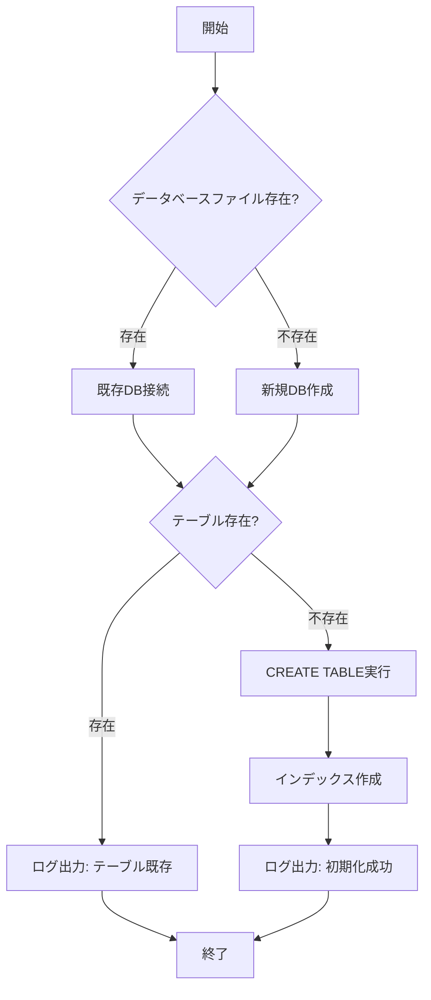

# 詳細設計書


## 目次

- [詳細設計書](#詳細設計書)
  - [目次](#目次)
  - [ドキュメント情報](#ドキュメント情報)
  - [変更履歴](#変更履歴)
  - [D-01: データベース初期化機能](#d-01-データベース初期化機能)
    - [概要](#概要)
    - [クラス名](#クラス名)
    - [ファイルパス](#ファイルパス)
    - [処理フロー](#処理フロー)
    - [実装コード例](#実装コード例)
    - [save\_employee() メソッド](#save_employee-メソッド)
      - [概要](#概要-1)
      - [引数・戻り値](#引数戻り値)
      - [CSVヘッダーとDBカラムのマッピング](#csvヘッダーとdbカラムのマッピング)
      - [実装コード例](#実装コード例-1)
    - [エラーハンドリング](#エラーハンドリング)
    - [学習ポイント](#学習ポイント)
  - [D-02: CSVインポート機能](#d-02-csvインポート機能)
    - [概要](#概要-2)
    - [クラス名](#クラス名-1)
    - [ファイルパス](#ファイルパス-1)
    - [実装コード例](#実装コード例-2)
    - [学習ポイント](#学習ポイント-1)
  - [D-03: バリデーション機能](#d-03-バリデーション機能)
    - [概要](#概要-3)
    - [クラス名](#クラス名-2)
    - [ファイルパス](#ファイルパス-2)
    - [バリデーションルール](#バリデーションルール)
    - [実装コード例](#実装コード例-3)
    - [学習ポイント](#学習ポイント-2)
    - [学習ポイント](#学習ポイント-3)
  - [D-04: ログ出力機能](#d-04-ログ出力機能)
    - [概要](#概要-4)
    - [ファイルパス](#ファイルパス-3)
    - [ログレベル](#ログレベル)
    - [実装コード例](#実装コード例-4)
    - [学習ポイント](#学習ポイント-4)
  - [D-10: エラーハンドリング統合設計](#d-10-エラーハンドリング統合設計)
    - [ファイルパス](#ファイルパス-4)
    - [エラーコード一覧](#エラーコード一覧)
    - [カスタム例外クラス](#カスタム例外クラス)
    - [Flaskエラーハンドラ例](#flaskエラーハンドラ例)
    - [学習ポイント](#学習ポイント-5)
  - [D-01-B: SQLAlchemy ORM による実装（移行ガイド）](#d-01-b-sqlalchemy-orm-による実装移行ガイド)
    - [概要](#概要-5)
    - [インストール](#インストール)
    - [新規ファイル: `database/models.py`](#新規ファイル-databasemodelspy)
    - [変更後: `database/database_manager.py`](#変更後-databasedatabase_managerpy)
    - [CRUD操作の書き方比較](#crud操作の書き方比較)
      - [sqlite3（移行前）](#sqlite3移行前)
      - [SQLAlchemy ORM（移行後）](#sqlalchemy-orm移行後)
    - [動作確認](#動作確認)
    - [学習ポイント](#学習ポイント-6)
  - [D-00: Flaskアプリケーション初期化](#d-00-flaskアプリケーション初期化)
    - [概要](#概要-6)
    - [ファイルパス](#ファイルパス-5)
    - [実装コード例](#実装コード例-5)
    - [学習ポイント](#学習ポイント-7)
  - [D-05: 社員一覧・詳細表示機能](#d-05-社員一覧詳細表示機能)
    - [概要](#概要-7)
    - [ファイルパス](#ファイルパス-6)
    - [URL仕様](#url仕様)
    - [実装コード例](#実装コード例-6)
    - [テンプレート例（base.html）](#テンプレート例basehtml)
    - [テンプレート例（list.html）](#テンプレート例listhtml)
    - [テンプレート例（detail.html）](#テンプレート例detailhtml)
    - [学習ポイント](#学習ポイント-8)
  - [D-06: 社員登録機能](#d-06-社員登録機能)
    - [概要](#概要-8)
    - [ファイルパス](#ファイルパス-7)
    - [URL仕様](#url仕様-1)
    - [実装コード例](#実装コード例-7)
    - [テンプレート例（new.html）](#テンプレート例newhtml)
    - [学習ポイント](#学習ポイント-9)
  - [D-07: 社員更新機能](#d-07-社員更新機能)
    - [概要](#概要-9)
    - [ファイルパス](#ファイルパス-8)
    - [URL仕様](#url仕様-2)
    - [実装コード例](#実装コード例-8)
    - [学習ポイント](#学習ポイント-10)
    - [テンプレート例（edit.html）](#テンプレート例edithtml)
  - [D-08: 社員削除機能](#d-08-社員削除機能)
    - [概要](#概要-10)
    - [ファイルパス](#ファイルパス-9)
    - [URL仕様](#url仕様-3)
    - [実装コード例](#実装コード例-9)
    - [学習ポイント](#学習ポイント-11)
    - [テンプレート例（delete.html）](#テンプレート例deletehtml)
  - [D-09: 検索機能](#d-09-検索機能)
    - [概要](#概要-11)
    - [ファイルパス](#ファイルパス-10)
    - [URL仕様](#url仕様-4)
    - [実装コード例](#実装コード例-10)
    - [学習ポイント](#学習ポイント-12)
    - [テンプレート例（search.html）](#テンプレート例searchhtml)
  - [D-11: スタイルシート（static/css/style.css）](#d-11-スタイルシートstaticcssstylecss)
    - [概要](#概要-12)
    - [ファイルパス](#ファイルパス-11)
    - [セクション別設計](#セクション別設計)
    - [実装コード](#実装コード)
    - [学習ポイント](#学習ポイント-13)

---

## ドキュメント情報

| 項目 | 内容 |
|-----|------|
| ドキュメント名 | 社員情報管理システム 詳細設計書 |
| 版数 | 1.6 |
| 作成日 | 2026-03-22 |
| 対象システム | 社員情報管理システム（Python学習用） |

---

## 変更履歴

| 版数 | 日付 | 変更内容 | 作成者 |
|-----|------|---------|-------|
| 1.0 | 2026-03-22 | 初版作成 | - |
| 1.1 | 2026-03-26 | D-01-B: SQLAlchemy ORM移行ガイド追加 | - |
| 1.2 | 2026-04-02 | D-00、D-05～D-09追加、詳細設計書を一本化 | - |
| 1.3 | 2026-04-03 | D-05 detail.htmlテンプレート例追加、D-07～D-09テンプレート例追加・目次更新 | - |
| 1.4 | 2026-04-04 | D-05 base.htmlテンプレート例・ファイルパス追加、D-06〜D-09 ファイルパスセクション追加（記載漏れ修正）、目次更新 | - |
| 1.5 | 2026-04-04 | D-11 スタイルシート（static/css/style.css）追加、D-10にファイルパス明示、ドキュメント情報版数修正、目次更新 | - |
| 1.6 | 2026-04-05 | D-05 実装コード例の記載ミス修正：`from werkzeug.exceptions import HTTPException` インポート追加、`except HTTPException: raise` パターン追加（`abort()` が `except Exception` に吸収されるバグを防ぐため） | - |

---

## D-01: データベース初期化機能

### 概要
SQLiteデータベースとemployeesテーブルを初期化する機能

### クラス名
`DatabaseManager`

### ファイルパス
`database/database_manager.py`

### 処理フロー



### 実装コード例

```python
# database/database_manager.py
import sqlite3
import logging
from pathlib import Path

class DatabaseManager:
    """データベース管理クラス"""
    
    def __init__(self, db_path):
        """
        コンストラクタ
        
        Args:
            db_path (str): データベースファイルパス
        """
        self.db_path = db_path
        self.logger = logging.getLogger(__name__)
        
    def initialize_database(self):
        """
        データベースとテーブルを初期化
        
        Returns:
            bool: 成功時True、失敗時False
        """
        try:
            # データベースディレクトリが存在しない場合は作成
            db_dir = Path(self.db_path).parent
            db_dir.mkdir(parents=True, exist_ok=True)
            
            # データベース接続
            conn = sqlite3.connect(self.db_path)
            cursor = conn.cursor()
            
            # テーブル作成SQL
            create_table_sql = """
            CREATE TABLE IF NOT EXISTS employees (
                employee_id TEXT PRIMARY KEY,
                name TEXT NOT NULL,
                name_kana TEXT NOT NULL,
                department TEXT NOT NULL,
                position TEXT NOT NULL,
                hire_date TEXT NOT NULL,
                salary INTEGER NOT NULL,
                email TEXT NOT NULL UNIQUE,
                phone TEXT,
                postal_code TEXT,
                address TEXT,
                notes TEXT,
                created_at TEXT NOT NULL DEFAULT CURRENT_TIMESTAMP,
                updated_at TEXT NOT NULL DEFAULT CURRENT_TIMESTAMP
            )
            """
            
            cursor.execute(create_table_sql)
            
            # インデックス作成
            index_sqls = [
                "CREATE INDEX IF NOT EXISTS idx_employee_name ON employees(name)",
                "CREATE INDEX IF NOT EXISTS idx_employee_department ON employees(department)",
                "CREATE INDEX IF NOT EXISTS idx_employee_hire_date ON employees(hire_date)"
            ]
            
            for index_sql in index_sqls:
                cursor.execute(index_sql)
            
            conn.commit()
            conn.close()
            
            self.logger.info(f"Database initialized successfully: {self.db_path}")
            return True
            
        except sqlite3.Error as e:
            self.logger.error(f"Database initialization failed: {e}")
            return False
    
    def get_connection(self):
        """
        データベース接続を取得
        
        Returns:
            sqlite3.Connection: データベース接続オブジェクト
        """
        try:
            conn = sqlite3.connect(self.db_path)
            conn.row_factory = sqlite3.Row  # 辞書形式で取得
            return conn
        except sqlite3.Error as e:
            self.logger.error(f"Database connection failed: {e}")
            raise
```
```python
# 動作確認用テストブロック
if __name__ == '__main__':
    import logging
    logging.basicConfig(level=logging.DEBUG)
    from config import Config

    db_manager = DatabaseManager(Config.DATABASE_PATH)
    success = db_manager.initialize_database()

    if success:
        print("✓ データベース初期化成功")
        conn = db_manager.get_connection()
        cursor = conn.cursor()
        cursor.execute("SELECT name FROM sqlite_master WHERE type='table'")
        tables = cursor.fetchall()
        print(f"テーブル一覧: {[dict(t)['name'] for t in tables]}")
        conn.close()
    else:
        print("✗ データベース初期化失敗")
```

> **補足**: `if __name__ == '__main__':` ブロックは直接実行時のみ動作します。
> 動作確認コマンド `python3 -m database.database_manager` でデータベース初期化のテストが可能です。
> `conn.row_factory = sqlite3.Row` を設定しているため、カラム名でアクセスできます。
>
> ⚠️ **使用上の注意 — コネクションリーク防止**: `get_connection()` で取得した接続は、**必ず `try/finally` ブロックで `conn.close()` を呼び出して**解放してください。
> `except` ブロックだけで `conn.close()` を呼ぶ実装では、例外が発生したときに接続が解放されず、`sqlite3.OperationalError: database is locked` が発生します。
>
> **推奨パターン:**
> ```python
> conn = db_manager.get_connection()
> try:
>     cursor = conn.cursor()
>     cursor.execute(...)
>     conn.commit()  # 書き込みの場合
> finally:
>     conn.close()  # 例外発生時でも必ず実行される
> ```

### save_employee() メソッド

#### 概要
CSVから読み込んだ1行分の社員データを `employees` テーブルに保存する。
同じ社員ID（PRIMARY KEY）が既に存在する場合は上書き更新（UPSERT）する。

#### 引数・戻り値

| 項目 | 内容 |
|------|------|
| 引数 `row_data` | CSVの1行データ（`dict`型）。キーはCSVヘッダー名（日本語） |
| 戻り値 | なし（`None`） |
| 例外 | `sqlite3.Error` が発生した場合は呼び出し元に再スロー |

#### CSVヘッダーとDBカラムのマッピング

| CSVヘッダー | DBカラム | 型 | 備考 |
|------------|---------|-----|------|
| 社員ID | employee_id | TEXT | PRIMARY KEY |
| 氏名 | name | TEXT | NOT NULL |
| 氏名カナ | name_kana | TEXT | NOT NULL |
| 部署 | department | TEXT | NOT NULL |
| 役職 | position | TEXT | NOT NULL |
| 入社日 | hire_date | TEXT | NOT NULL（YYYY-MM-DD形式） |
| 給与 | salary | INTEGER | NOT NULL。`int()` でキャスト |
| メールアドレス | email | TEXT | NOT NULL、UNIQUE |

#### 実装コード例

```python
def save_employee(self, row_data: dict) -> None:
    """社員データをDBに保存する（既存の場合は更新）

    Args:
        row_data (dict): CSVの1行データ。キーはCSVヘッダー名（日本語）

    Raises:
        sqlite3.Error: データベース操作に失敗した場合
    """
    # INSERT OR REPLACE: 同じPRIMARY KEY(employee_id)が存在する場合は上書き更新（UPSERT）
    sql = """
    INSERT OR REPLACE INTO employees
        (employee_id, name, name_kana, department, position,
         hire_date, salary, email, updated_at)
    VALUES
        (?, ?, ?, ?, ?, ?, ?, ?, CURRENT_TIMESTAMP)
    """
    # CSVキー（日本語）をDBカラム（英語）にマッピングしてパラメータタプルを組み立てる
    # 給与はCSV上では文字列なので int() でキャストする
    params = (
        row_data['社員ID'],
        row_data['氏名'],
        row_data['氏名カナ'],
        row_data['部署'],
        row_data['役職'],
        row_data['入社日'],
        int(row_data['給与']),
        row_data['メールアドレス'],
    )
    # DB接続を取得してSQL実行（row_factory=sqlite3.Rowで辞書形式アクセス可能）
    conn = self.get_connection()
    try:
        cursor = conn.cursor()
        cursor.execute(sql, params)
        conn.commit()
        self.logger.info(f"社員データを保存しました: {row_data['社員ID']}")
    except sqlite3.Error as e:
        # エラー発生時はロールバックして変更を取り消す
        conn.rollback()
        self.logger.error(f"社員データの保存に失敗しました: {e}")
        raise
    finally:
        conn.close()
```

---

### エラーハンドリング

| エラーコード | エラー状況 | 判定基準 | 処理内容 |
|------------|----------|---------|---------|
| E001 | データベース接続失敗 | sqlite3.Errorが発生 | ログ出力、例外再スロー |
| E002 | テーブル作成失敗 | CREATE TABLE実行時にエラー | ログ出力、False返却 |
| E003 | 社員データ保存失敗 | sqlite3.Errorが発生 | ロールバック、ログ出力、例外再スロー |

### 学習ポイント

- ✅ クラス定義（class）
- ✅ コンストラクタ（\_\_init\_\_）
- ✅ with文によるリソース管理
- ✅ try-except例外処理
- ✅ logging モジュール
- ✅ sqlite3 モジュール
- ✅ pathlib による Path 操作
- ✅ 三重引用符による複数行文字列
- ✅ INSERT OR REPLACE（UPSERT）によるデータ重複対応
- ✅ パラメータ化クエリ（`?` プレースホルダー）によるSQLインジェクション防止

---

## D-02: CSVインポート機能

### 概要
CSVファイルから社員データを一括登録する機能

### クラス名
`CSVHandler`

### ファイルパス
`utils/csv_handler.py`

### 実装コード例

```python
# utils/csv_handler.py
import csv
import logging
from typing import List, Dict, Tuple

class CSVHandler:
    """CSVファイルの読み込みとデータベースへの保存を担当するクラス"""

    def __init__(self, db_manager, validator):
        self.db_manager = db_manager
        self.validator = validator
        self.logger = logging.getLogger(__name__)

        # 必須ヘッダー列（CSVにこれらが全て存在しなければインポートエラー）
        self.required_headers = [
            '社員ID', '氏名', '氏名カナ', '部署', '役職',
            '入社日', '給与', 'メールアドレス'
            ]

    def import_from_csv(self, file_path: str) -> Tuple[int, List[str]]:
        """CSVファイルを読み込み、データベースに保存する"""
        self.logger.info(f"CSVファイルのインポートを開始: {file_path}")
        success_count = 0
        error_messages = []

        try:
            # UTF-8エンコーディングでCSVを開き、列名をキーにした辞書として行データを取得する
            with open(file_path, mode='r', encoding='utf-8') as csvfile:
                reader = csv.DictReader(csvfile)

                # ヘッダーの検証
                if not self._validate_headers(reader.fieldnames):
                    error_message = f"CSVファイルのヘッダーが不正です。必要なヘッダー: {self.required_headers}"
                    self.logger.error(error_message)
                    return success_count, [error_message]

                # データの検証と保存（バリデーション通過行のみDB保存し、エラー行はスキップ）
                for row_data in reader:
                    validation_errors = self.validator.validate_employee_data(row_data)
                    if validation_errors:
                        error_message = f"社員ID {row_data.get('社員ID', '不明')}: " + "; ".join(validation_errors)
                        self.logger.warning(error_message)
                        error_messages.append(error_message)
                        continue

                    try:
                        self.db_manager.save_employee(row_data)
                        success_count += 1
                    except Exception as e:
                        error_message = f"社員ID {row_data.get('社員ID', '不明')}: データベースへの保存に失敗 - {str(e)}"
                        self.logger.error(error_message)
                        error_messages.append(error_message)

        except FileNotFoundError:
            error_message = f"ファイルが見つかりません: {file_path}"
            self.logger.error(error_message)
            return success_count, [error_message]
        except Exception as e:
            error_message = f"CSVファイルの読み込み中にエラーが発生: {str(e)}"
            self.logger.error(error_message)
            return success_count, [error_message]

        self.logger.info(f"CSVファイルのインポートが完了しました。成功: {success_count}, エラー: {len(error_messages)}")
        return success_count, error_messages


    def _validate_headers(self, headers) -> bool:
        """CSVヘッダーの検証"""
        if not headers:
            return False
        # required_headers の全要素が fieldnames に含まれているか一括確認
        return all(header_row_data in headers for header_row_data in self.required_headers)
```

### 学習ポイント

- ✅ csv モジュール（DictReader）
- ✅ Type Hints（Tuple, List, Dict）
- ✅ enumerate関数
- ✅ 辞書の get メソッド

---

## D-03: バリデーション機能

### 概要
入力データの妥当性を検証する機能

### クラス名
`DataValidator`

### ファイルパス
`utils/validator.py`

### バリデーションルール

| 項目 | ルール | 正規表現 |
|-----|-------|---------|
| 社員ID | 英字1文字+数字4桁 | `^[A-Z][0-9]{4}$` |
| 氏名カナ | 全角カタカナ | `^[ァ-ヴー\s　]+$` |
| メールアドレス | 標準メール形式 | 組み込みre |
| 入社日 | YYYY-MM-DD形式 | `^\d{4}-\d{2}-\d{2}$` |

### 実装コード例

```python
# utils/validator.py
import re
from datetime import datetime
from typing import Tuple

class DataValidator:
    """データバリデーションクラス"""
    
    # 正規表現パターン（クラス変数として事前コンパイル済み → 毎回コンパイルしないため高速）
    EMPLOYEE_ID_PATTERN = re.compile(r'^[A-Z][0-9]{4}$')
    NAME_KANA_PATTERN = re.compile(r'^[ァ-ヴー\s　]+$')
    EMAIL_PATTERN = re.compile(r'^[a-zA-Z0-9._%+-]+@[a-zA-Z0-9.-]+\.[a-zA-Z]{2,}$')
    PHONE_PATTERN = re.compile(r'^[0-9-]+$')
    POSTAL_CODE_PATTERN = re.compile(r'^\d{3}-\d{4}$')
    HIRE_DATE_PATTERN = re.compile(r'^\d{4}-\d{2}-\d{2}$')
    
    # 有効な選択肢リスト（これ以外の値はバリデーションエラーとなる）
    VALID_DEPARTMENTS = ['営業部', '開発部', '総務部', '人事部', '経理部']
    VALID_POSITIONS = ['部長', '課長', '係長', '主任', '一般']
    
    def validate_employee_id(self, employee_id: str) -> Tuple[bool, str]:
        """社員IDのバリデーション"""
        if not employee_id:
            return False, "社員IDは必須です"
        if not self.EMPLOYEE_ID_PATTERN.match(employee_id):
            return False, "社員IDは英字1文字+数字4桁の形式です（例: A0001）"
        return True, ""
    
    def validate_name(self, name: str) -> Tuple[bool, str]:
        """氏名のバリデーション"""
        if not name or not name.strip():
            return False, "氏名は必須です"
        if len(name) > 50:
            return False, "氏名は50文字以内です"
        return True, ""
    
    def validate_email(self, email: str) -> Tuple[bool, str]:
        """メールアドレスのバリデーション"""
        if not email:
            return False, "メールアドレスは必須です"
        if len(email) > 255:
            return False, "メールアドレスは255文字以内です"
        if not self.EMAIL_PATTERN.match(email):
            return False, "正しいメールアドレス形式で入力してください"
        return True, ""
    
    def validate_hire_date(self, hire_date: str) -> Tuple[bool, str]:
        """入社日のバリデーション"""
        if not hire_date:
            return False, "入社日は必須です"
        if not self.HIRE_DATE_PATTERN.match(hire_date):
            return False, "入社日はYYYY-MM-DD形式で入力してください"
        
        try:
            date_obj = datetime.strptime(hire_date, '%Y-%m-%d')
            if date_obj.year < 1900:
                return False, "入社日は1900年以降の日付を入力してください"
            if date_obj > datetime.now():
                return False, "入社日は今日以前の日付を入力してください"
        except ValueError:
            return False, "正しい日付を入力してください"
        
        return True, ""
    
    def validate_salary(self, salary: str) -> Tuple[bool, str]:
        """給与のバリデーション"""
        if not salary:
            return False, "給与は必須です"
        try:
            salary_int = int(salary)
            if salary_int < 0:
                return False, "給与は0以上の整数です"
            if salary_int > 999999999:
                return False, "給与は999,999,999以下です"
        except ValueError:
            return False, "給与は整数で入力してください"
        return True, ""
    
    def validate_name_kana(self, name_kana: str) -> Tuple[bool, str]:
        """氏名カナのバリデーション"""
        if not name_kana or not name_kana.strip():
            return False, "氏名カナは必須です"
        if not self.NAME_KANA_PATTERN.match(name_kana):
            return False, "氏名カナは全角カタカナで入力してください"
        if len(name_kana) > 50:
            return False, "氏名カナは50文字以内です"
        return True, ""
    
    def validate_department(self, department: str) -> Tuple[bool, str]:
        """部署のバリデーション"""
        if not department:
            return False, "部署は必須です"
        if department not in self.VALID_DEPARTMENTS:
            return False, f"部署は次のいずれかを選択してください: {', '.join(self.VALID_DEPARTMENTS)}"
        return True, ""
    
    def validate_position(self, position: str) -> Tuple[bool, str]:
        """役職のバリデーション"""
        if not position:
            return False, "役職は必須です"
        if position not in self.VALID_POSITIONS:
            return False, f"役職は次のいずれかを選択してください: {', '.join(self.VALID_POSITIONS)}"
        return True, ""
    
    def validate_phone(self, phone: str) -> Tuple[bool, str]:
        """電話番号のバリデーション（オプション項目）"""
        if not phone or not phone.strip():
            return True, ""  # 空欄OK
        if not self.PHONE_PATTERN.match(phone):
            return False, "電話番号は数字とハイフンのみ入力可能です"
        if len(phone) > 20:
            return False, "電話番号は20文字以内です"
        return True, ""
    
    def validate_postal_code(self, postal_code: str) -> Tuple[bool, str]:
        """郵便番号のバリデーション（オプション項目）"""
        if not postal_code or not postal_code.strip():
            return True, ""  # 空欄OK
        if not self.POSTAL_CODE_PATTERN.match(postal_code):
            return False, "郵便番号は123-4567形式で入力してください"
        return True, ""
    
    def validate_address(self, address: str) -> Tuple[bool, str]:
        """住所のバリデーション（オプション項目）"""
        if not address or not address.strip():
            return True, ""  # 空欄OK
        if len(address) > 255:
            return False, "住所は255文字以内です"
        return True, ""
    

    def validate_notes(self, notes: str) -> Tuple[bool, str]:
        """備考のバリデーション（オプション項目）"""
        if not notes or not notes.strip():
            return True, ""  # 空欄OK
        if len(notes) > 1000:
            return False, "備考は1000文字以内です"
        return True, ""

    def validate_employee_data(self, data: dict) -> list:
        """社員データの総合バリデーション（必須8項目を一括チェック）"""
        errors = []
        # バリデーター関数と対応する入力値のペアをリストで定義（関数を直接呼び出さず一覧化）
        checks = [
            (self.validate_employee_id,  data.get('社員ID', '')),
            (self.validate_name,         data.get('氏名', '')),
            (self.validate_name_kana,    data.get('氏名カナ', '')),
            (self.validate_department,   data.get('部署', '')),
            (self.validate_position,     data.get('役職', '')),
            (self.validate_email,        data.get('メールアドレス', '')),
            (self.validate_hire_date,    data.get('入社日', '')),
            (self.validate_salary,       data.get('給与', '')),
        ]
        for validator_func, value in checks:
            is_valid, message = validator_func(value)
            if not is_valid:
                errors.append(message)
        return errors


if __name__ == "__main__":
    # テスト実行
    validator = DataValidator()
    
    print("=== 必須項目のバリデーションテスト ===")
    # 正常ケース
    tests = [
        ("社員ID", validator.validate_employee_id, "A0001"),
        ("氏名", validator.validate_name, "山田太郎"),
        ("氏名カナ", validator.validate_name_kana, "ヤマダタロウ"),
        ("部署", validator.validate_department, "営業部"),
        ("役職", validator.validate_position, "部長"),
        ("メール", validator.validate_email, "test@example.com"),
        ("入社日", validator.validate_hire_date, "2020-01-01"),
        ("給与", validator.validate_salary, "5000000"),
    ]
    
    for label, func, value in tests:
        valid, msg = func(value)
        status = "✓" if valid else "✗"
        print(f"{status} {label}: {value} - {msg if msg else 'OK'}")
    
    print("\n=== オプション項目のバリデーションテスト ===")
    optional_tests = [
        ("電話番号", validator.validate_phone, "03-1234-5678"),
        ("郵便番号", validator.validate_postal_code, "123-4567"),
        ("住所", validator.validate_address, "東京都千代田区1-1"),
        ("備考", validator.validate_notes, "特になし"),
    ]
    
    for label, func, value in optional_tests:
        valid, msg = func(value)
        status = "✓" if valid else "✗"
        print(f"{status} {label}: {value} - {msg if msg else 'OK'}")
    
    print("\n=== エラーケースのテスト ===")
    error_tests = [
        ("社員ID不正", validator.validate_employee_id, "0001"),
        ("カナ不正", validator.validate_name_kana, "yamada"),
        ("部署不正", validator.validate_department, "不明部署"),
        ("給与負数", validator.validate_salary, "-1000"),
    ]
    
    for label, func, value in error_tests:
        valid, msg = func(value)
        status = "✓" if valid else "✗"
        print(f"{status} {label}: {value} - {msg}")
```

> **補足**: D-03 の実装コード例には全バリデーターメソッドを含みます。
> 各メソッドは `Tuple[bool, str]` を返します（`True, ""` = OK、`False, "エラーメッセージ"` = NG）。
> `if __name__ == '__main__':` ブロックでテスト実行が可能です。

### 学習ポイント

- ✅ 正規表現（re.compile, match）```

### 学習ポイント

- ✅ 正規表現（re.compile, match）
- ✅ datetime モジュール
- ✅ try-except ValueError
- ✅ Type Hints

---

## D-04: ログ出力機能

### 概要
システム動作ログを記録する機能

### ファイルパス
`utils/logger.py`

### ログレベル

| レベル | 用途 |
|-------|------|
| DEBUG | デバッグ情報 |
| INFO | 通常動作の記録 |
| WARNING | 警告 |
| ERROR | エラー |
| CRITICAL | 致命的エラー |

### 実装コード例

```python
# utils/logger.py
import logging
from logging.handlers import TimedRotatingFileHandler
import os
from config import Config

def setup_logger(name='employee_system', log_file=None, level=None):
    """ロガーのセットアップ。
    log_file と level が未指定の場合は config.py の Config クラスの値を使用。
    ログレベルは config.py の LOG_LEVEL で管理する。
    """
    # log_file が未指定の場合は Config.LOG_FILE を使用
    if log_file is None:
        log_file = Config.LOG_FILE
    # level が未指定の場合は Config.LOG_LEVEL を文字列から logging 定数に変換して使用
    if level is None:
        level = getattr(logging, Config.LOG_LEVEL, logging.INFO)

    log_dir = os.path.dirname(log_file)
    # ログディレクトリが存在しない場合は作成する
    if log_dir and not os.path.exists(log_dir):
        os.makedirs(log_dir)

    # ロガーを取得（同一名のロガーが存在する場合はそれを再利用）
    logger = logging.getLogger(name)
    logger.setLevel(level)

    # 同一名のロガーを再利用する際に重複ハンドラーが追加されるのを防ぐ
    if logger.hasHandlers():
        logger.handlers.clear()

    # ログのフォーマットを定義
    formatter = logging.Formatter(
        '[%(asctime)s] %(levelname)s in %(module)s: %(message)s',
        datefmt='%Y-%m-%d %H:%M:%S'
    )

    file_handler = TimedRotatingFileHandler(
        log_file,
        when='midnight',    # 深夜0時に切り替え
        interval=1,         # 1日ごと
        backupCount=30,     # 30日分保持
        encoding='utf-8'
    )
    file_handler.setFormatter(formatter)

    # コンソールハンドラーも追加（開発中はコンソールにもログを出力するため）
    console_handler = logging.StreamHandler()
    console_handler.setFormatter(formatter)

    logger.addHandler(file_handler)
    logger.addHandler(console_handler)

    return logger
```

```python
# グローバルロガー初期化
app_logger = setup_logger()

if __name__ == "__main__":
    # テスト実行
    app_logger.debug("DEBUGメッセージ")
    app_logger.info("INFOメッセージ")
    app_logger.warning("WARNINGメッセージ")
    app_logger.error("ERRORメッセージ")
    app_logger.critical("CRITICALメッセージ")
```

> **補足**: ログレベルは `config.py` の `Config.LOG_LEVEL` で一元管理します。  
> 変更する場合は `config.py` の `LOG_LEVEL` の値を修正するか、
> 環境変数 `LOG_LEVEL=DEBUG` を設定することで切り替えられます。  
> `app_logger = setup_logger()` はモジュールとして import された際に
> グローバルなロガーインスタンスを利用できるようにするための初期化です。  
> `if __name__ == "__main__":` ブロックは直接実行時のみ動作し、
> 動作確認コマンド `python3 utils/logger.py` で出力を確認するために必要です。


### 学習ポイント

- ✅ logging モジュール
- ✅ TimedRotatingFileHandler
- ✅ os.path モジュール

---

## D-10: エラーハンドリング統合設計

### ファイルパス

`utils/exceptions.py`（新規作成）

### エラーコード一覧

| コード | エラー内容 | レベル | 対応 |
|-------|----------|-------|-----|
| E001 | データベース接続失敗 | CRITICAL | ログ出力 + 例外スロー |
| E002 | テーブル作成失敗 | CRITICAL | ログ出力 + False返却 |
| E003 | CSVファイル読み込み失敗 | ERROR | ログ出力 + エラーメッセージ |
| E004 | バリデーションエラー | WARNING | エラーメッセージ返却 |
| E005 | 社員ID重複 | ERROR | ログ出力 + エラー画面 |
| E006 | メールアドレス重複 | ERROR | ログ出力 + エラー画面 |
| E007 | 存在しない社員ID | ERROR | ログ出力 + 404画面 |

### カスタム例外クラス

```python
# utils/exceptions.py

class EmployeeSystemException(Exception):
    """システム共通の基底例外クラス"""
    def __init__(self, message, error_code=None):
        self.message = message
        self.error_code = error_code
        super().__init__(self.message)

class DatabaseException(EmployeeSystemException):
    """データベース関連の例外"""
    pass

class ValidationException(EmployeeSystemException):
    """バリデーション関連の例外"""
    pass

class NotFoundException(EmployeeSystemException):
    """データ不存在の例外"""
    pass
```

### Flaskエラーハンドラ例

```python
# app.py に追記するエラーハンドラ
@app.errorhandler(404)
def not_found(error):
    return render_template('errors/404.html'), 404

@app.errorhandler(500)
def internal_error(error):
    logger.error(f"Internal server error: {error}")
    return render_template('errors/500.html'), 500
```

> **補足**: エラーハンドラは `app.py` に追記します。
> テンプレートは `templates/errors/404.html` と `templates/errors/500.html` を作成してください。
> `logger` は `utils.logger` の `setup_logger()` で取得したインスタンスを使用します。

### 学習ポイント

- ✅ カスタム例外クラス
- ✅ 継承（Exception継承）
- ✅ super()関数
- ✅ 例外のraise

---


---

## D-01-B: SQLAlchemy ORM による実装（移行ガイド）

### 概要

D-01 では `sqlite3` モジュールを直接使用し、SQL文をコード内にハードコードしていました。
本セクションでは、Python の業界標準 ORM ライブラリである **SQLAlchemy** を使用した実装へ移行する方法を説明します。

**移行のメリット**:
- SQL文をコードに書かず、Pythonクラスでテーブル定義を管理できる
- パラメータバインディングが自動化され、SQLインジェクション対策が強化される
- SQLite → PostgreSQL など、DBエンジンの変更が容易になる

---

### インストール

```bash
pip install sqlalchemy
pip freeze > requirements.txt
```

---

### 新規ファイル: `database/models.py`

テーブル定義をPythonクラスとして記述します。

```python
# database/models.py
from sqlalchemy import Column, Integer, String, Text, Index
from sqlalchemy.orm import DeclarativeBase
from sqlalchemy.sql import func


class Base(DeclarativeBase):
    """全モデルの基底クラス"""
    pass


class Employee(Base):
    """社員テーブルモデル"""
    __tablename__ = "employees"

    employee_id = Column(String, primary_key=True)
    name        = Column(String, nullable=False)
    name_kana   = Column(String, nullable=False)
    department  = Column(String, nullable=False)
    position    = Column(String, nullable=False)
    hire_date   = Column(String, nullable=False)
    salary      = Column(Integer, nullable=False)
    email       = Column(String, nullable=False, unique=True)
    phone       = Column(String)
    postal_code = Column(String)
    address     = Column(Text)
    notes       = Column(Text)
    created_at  = Column(String, nullable=False, server_default=func.current_timestamp())
    updated_at  = Column(String, nullable=False, server_default=func.current_timestamp())

    __table_args__ = (
        Index("idx_employees_name", "name"),
        Index("idx_employees_department", "department"),
        Index("idx_employees_hire_date", "hire_date"),
    )
```

> **補足**: `__table_args__` にインデックスを定義することで、`Base.metadata.create_all()` 実行時に
> テーブルとインデックスが同時に作成されます。SQL文を一行も書く必要はありません。

---

### 変更後: `database/database_manager.py`

`sqlite3` の直接操作を SQLAlchemy に置き換えます。

```python
# database/database_manager.py（SQLAlchemy版）
import logging
from pathlib import Path
from sqlalchemy import create_engine
from sqlalchemy.orm import sessionmaker, Session
from database.models import Base


class DatabaseManager:
    """データベース管理クラス（SQLAlchemy版）"""

    def __init__(self, db_path: str):
        self.db_path = db_path
        self.logger = logging.getLogger(__name__)
        self._engine = None
        self._SessionFactory = None

    def initialize_database(self) -> bool:
        """データベースとテーブルを初期化

        Returns:
            bool: 成功時にTrue、失敗時にFalse
        """
        try:
            db_dir = Path(self.db_path).parent
            db_dir.mkdir(parents=True, exist_ok=True)

            # エンジン作成（sqlite:///は相対パス、sqlite:////は絶対パス）
            self._engine = create_engine(f"sqlite:///{self.db_path}", echo=False)

            # モデル定義からテーブル・インデックスを自動生成（CREATE TABLE IF NOT EXISTS相当）
            Base.metadata.create_all(self._engine)

            self._SessionFactory = sessionmaker(bind=self._engine)

            self.logger.info(f"Database initialized successfully: {self.db_path}")
            return True

        except Exception as e:
            self.logger.error(f"Database initialization failed: {e}")
            return False

    def get_session(self) -> Session:
        """DBセッションを取得（with文で使用すること）

        Returns:
            Session: SQLAlchemyセッションオブジェクト

        Example:
            with db_manager.get_session() as session:
                employees = session.query(Employee).all()
        """
        if self._SessionFactory is None:
            raise RuntimeError("initialize_database() を先に呼び出してください")
        return self._SessionFactory()
```

---

### CRUD操作の書き方比較

#### sqlite3（移行前）

```python
conn = db_manager.get_connection()
cursor = conn.cursor()

# 登録
cursor.execute(
    "INSERT INTO employees (employee_id, name, ...) VALUES (?, ?, ...)",
    ("A0001", "山田太郎", ...)
)
conn.commit()

# 検索
cursor.execute("SELECT * FROM employees WHERE department = ?", ("営業部",))
rows = cursor.fetchall()
conn.close()
```

#### SQLAlchemy ORM（移行後）

```python
from database.models import Employee

# セッションはwith文で使用するとcommit/rollback/closeが自動管理される
with db_manager.get_session() as session:

    # 登録
    emp = Employee(employee_id="A0001", name="山田太郎", department="営業部", ...)
    session.add(emp)
    session.commit()

    # 1件取得（主キー検索）
    emp = session.get(Employee, "A0001")

    # 全件取得
    employees = session.query(Employee).all()

    # 条件検索（WHERE department = '営業部'）
    results = session.query(Employee).filter(Employee.department == "営業部").all()

    # 複数条件検索
    results = session.query(Employee).filter(
        Employee.department == "営業部",
        Employee.salary >= 5000000
    ).all()

    # 更新
    emp = session.get(Employee, "A0001")
    emp.salary = 9000000
    session.commit()

    # 削除
    emp = session.get(Employee, "A0001")
    session.delete(emp)
    session.commit()
```

> **補足**: `session.query(Employee).all()` の戻り値は `Employee` オブジェクトのリストです。
> 各カラムへのアクセスは `emp.name`、`emp.department` のようにドット記法で行います。

---

### 動作確認

```bash
# SQLAlchemyインストール確認
python3 -c "import sqlalchemy; print(sqlalchemy.__version__)"

# データベース初期化テスト
python3 -m database.database_manager

# テーブル・インデックス確認
sqlite3 database/employees.db << 'EOF'
.schema employees
.indexes employees
.quit
EOF
```

### 学習ポイント

- ✅ SQLAlchemy の `DeclarativeBase` によるモデル定義
- ✅ `create_engine()` による接続設定
- ✅ `Base.metadata.create_all()` による自動DDL実行
- ✅ `sessionmaker` と `Session` によるトランザクション管理
- ✅ with文によるセッションのライフサイクル管理
- ✅ ORM を使ったCRUD操作（SQL文不要）


---

## D-00: Flaskアプリケーション初期化

### 概要
Flaskアプリケーションの作成とBlueprintの登録

### ファイルパス
`app.py`（プロジェクトルート直下）

### 実装コード例

```python
# app.py
from flask import Flask
from config import Config
from utils.logger import setup_logger

# アプリケーションファクトリーパターンを採用する事で下記のメリットがある
# - アプリの設定や拡張機能の初期化を一元管理できる
# - テストの際に異なる設定でアプリを簡単に作成できる
# - 循環インポートを回避できる

def create_app():
    """Flaskアプリケーションファクトリー関数"""
    # Flaskアプリのインスタンスを作成（__name__でテンプレート等のパスを自動解決）
    app = Flask(__name__)
    # アプリの設定をルートディレクトリ直下のconfig.pyから読み込む
    app.config.from_object(Config)
    # アプリ用のロギング設定を初期化（utils/logger.pyのsetup_logger関数）
    setup_logger()
    # 従業員関連のルート（URLエンドポイント）をまとめたBlueprintを読み込み、アプリに登録する。
    # 下記のインポートは関数内で行うことで、循環インポートを回避する。
    from routes.employee_routes import employee_bp
    app.register_blueprint(employee_bp)
    return app

if __name__ == "__main__":
    app = create_app()
    app.run(debug=True)
```

> **補足**: アプリケーションファクトリーパターンを使用します。
> `setup_logger()` はステップ2で実装したロガーセットアップ関数です。
> `employee_bp` はステップ7以降で実装する `Blueprint` インスタンスです。
> `if __name__ == '__main__':` で直接起動が可能です（開発時のみ）。

### 学習ポイント

- ✅ Flaskアプリケーションファクトリーパターン（`create_app()`）
- ✅ `Blueprint`（モジュール分割）
- ✅ `app.config.from_object()`
- ✅ `app.register_blueprint()`

---

## D-05: 社員一覧・詳細表示機能

### 概要
全社員の一覧表示と個別詳細表示機能

### ファイルパス

| ファイル | 種別 |
|---------|------|
| `routes/employee_routes.py` | Blueprintルート（新規作成） |
| `templates/base.html` | 共通ベーステンプレート（新規作成） |
| `templates/employees/list.html` | 社員一覧テンプレート（新規作成） |
| `templates/employees/detail.html` | 社員詳細テンプレート（新規作成） |

### URL仕様

| URL | メソッド | 機能 |
|-----|---------|------|
| `/` | GET | 社員一覧表示 |
| `/employee/<employee_id>` | GET | 社員詳細表示 |

### 実装コード例

```python
# routes/employee_routes.py
from flask import Blueprint, render_template, abort
from werkzeug.exceptions import HTTPException
import logging

employee_bp = Blueprint('employee', __name__)
logger = logging.getLogger(__name__)

@employee_bp.route('/')
def index():
    """社員一覧表示"""
    try:
        # 関数内インポートで循環インポートを回避しつつDBマネージャーをインスタンス化
        from database.database_manager import DatabaseManager
        from config import Config
        db_manager = DatabaseManager(Config.DATABASE_PATH)
        conn = db_manager.get_connection()
        try:
            cursor = conn.cursor()
            
            # 一覧表示に必要な列のみ取得し、employee_id順（昇順）でソート
            cursor.execute("""
                SELECT employee_id, name, name_kana, department, position, hire_date, email
                FROM employees
                ORDER BY employee_id
            """)
            
            employees = cursor.fetchall()
        finally:
            conn.close()
        
        logger.info(f"社員一覧表示: {len(employees)}件")
        return render_template('employees/list.html', employees=employees)
        
    except HTTPException:
        raise
    except Exception as e:
        logger.error(f"社員一覧表示エラー: {e}")
        abort(500)

@employee_bp.route('/employee/<employee_id>')
def detail(employee_id):
    """社員詳細表示"""
    try:
        # 関数内インポートで循環インポートを回避しつつDBマネージャーをインスタンス化
        from database.database_manager import DatabaseManager
        from config import Config
        db_manager = DatabaseManager(Config.DATABASE_PATH)
        conn = db_manager.get_connection()
        try:
            cursor = conn.cursor()
            
            # URLパラメータで受け取った employee_id で社員レコードを1件取得
            cursor.execute("""
                SELECT * FROM employees WHERE employee_id = ?
            """, (employee_id,))
            
            employee = cursor.fetchone()
        finally:
            conn.close()
        
        # 指定IDの社員が存在しない場合は404エラーを返す
        if employee is None:
            logger.warning(f"社員が見つかりません: {employee_id}")
            abort(404)
        
        logger.info(f"社員詳細表示: {employee_id}")
        return render_template('employees/detail.html', employee=employee)
        
    except HTTPException:
        raise
    except Exception as e:
        logger.error(f"社員詳細表示エラー: {e}")
        abort(500)
```

### テンプレート例（base.html）

すべての画面テンプレートが `` で継承する共通レイアウトファイルです。
ナビゲーションバー・フラッシュメッセージ表示・ブロック定義（`title`, `content`）を提供します。

```html
<!-- templates/base.html -->
<!DOCTYPE html>
<html lang="ja">
<head>
    <meta charset="UTF-8">
    <meta name="viewport" content="width=device-width, initial-scale=1.0">
    <title>社員情報管理システム</title>
    <link rel="stylesheet" href="{{ url_for('static', filename='css/style.css') }}">
</head>
<body>
    <nav>
        <a href="/">社員一覧</a>
        <a href="/employee/new">新規登録</a>
        <a href="/search">検索</a>
        <a href="/import">CSVインポート</a>
    </nav>
    <main>
        
          
            
              <div class="flash {{ category }}">{{ message }}</div>
            
          
        
        
    </main>
</body>
</html>
```

> 📌 **実装ポイント**:
> - `` と `` の2つのブロックを定義します
> - 各画面テンプレートは `` で継承し、これらのブロックを上書きします
> - `get_flashed_messages()` を base.html に一元化することで、全画面でフラッシュメッセージが表示されます
> - `url_for('static', filename='css/style.css')` でCSSファイルへの参照を解決します

### テンプレート例（list.html）

```html
<!-- templates/employees/list.html -->


社員一覧


<div class="container">
    <h1>社員一覧</h1>
    <a href="/employee/new" class="btn btn-primary">新規登録</a>
    
    <table class="table">
        <thead>
            <tr>
                <th>社員ID</th>
                <th>氏名</th>
                <th>部署</th>
                <th>役職</th>
                <th>入社日</th>
                <th>操作</th>
            </tr>
        </thead>
        <tbody>
        
            <tr>
                <td>{{ emp.employee_id }}</td>
                <td>{{ emp.name }}</td>
                <td>{{ emp.department }}</td>
                <td>{{ emp.position }}</td>
                <td>{{ emp.hire_date }}</td>
                <td>
                    <a href="/employee/{{ emp.employee_id }}">詳細</a>
                    <a href="/employee/{{ emp.employee_id }}/edit">編集</a>
                    <a href="/employee/{{ emp.employee_id }}/delete">削除</a>
                </td>
            </tr>
        
        </tbody>
    </table>
</div>

```

### テンプレート例（detail.html）

```html
<!-- templates/employees/detail.html -->


社員詳細 - {{ employee.name }}


<div class="container">
    <h1>社員詳細</h1>

    <table class="table">
        <tbody>
            <tr>
                <th>社員ID</th>
                <td>{{ employee.employee_id }}</td>
            </tr>
            <tr>
                <th>氏名</th>
                <td>{{ employee.name }}</td>
            </tr>
            <tr>
                <th>氏名カナ</th>
                <td>{{ employee.name_kana }}</td>
            </tr>
            <tr>
                <th>部署</th>
                <td>{{ employee.department }}</td>
            </tr>
            <tr>
                <th>役職</th>
                <td>{{ employee.position }}</td>
            </tr>
            <tr>
                <th>入社日</th>
                <td>{{ employee.hire_date }}</td>
            </tr>
            <tr>
                <th>給与</th>
                <td>{{ employee.salary }}</td>
            </tr>
            <tr>
                <th>メールアドレス</th>
                <td>{{ employee.email }}</td>
            </tr>
        </tbody>
    </table>

    <a href="/">一覧に戻る</a>
    <a href="/employee/{{ employee.employee_id }}/edit">編集</a>
    <a href="/employee/{{ employee.employee_id }}/delete">削除</a>
</div>

```

### 学習ポイント

- ✅ Flask Blueprint
- ✅ @デコレータ（ルート定義）
- ✅ render_template（Jinja2）
- ✅ SQLiteのSELECT文
- ✅ fetchall / fetchone
- ✅ abort (HTTPエラー)
- ✅ Jinja2テンプレート構文（, {{ }}）

---

## D-06: 社員登録機能

### 概要
新規社員情報を登録する機能

### ファイルパス

| ファイル | 種別 |
|---------|------|
| `routes/employee_routes.py` | Blueprintルート（追記） |
| `templates/employees/new.html` | 社員登録テンプレート（新規作成） |

### URL仕様

| URL | メソッド | 機能 |
|-----|---------|------|
| `/employee/new` | GET | 登録フォーム表示 |
| `/employee/new` | POST | 登録処理実行 |

### 実装コード例

```python
# routes/employee_routes.py (追加分)
# 下記import文の内容は既に実装済のfrom flask import Blueprint, render_template, abortの後ろに追記する
from flask import request, redirect, url_for, flash

@employee_bp.route('/employee/new', methods=['GET', 'POST'])
def new_employee():
    """社員新規登録"""
    if request.method == 'GET':
        # GETリクエスト: 入力値なしの空フォームを表示
        return render_template('employees/new.html')
    
    # POST処理（フォーム送信）
    try:
        from database.database_manager import DatabaseManager
        from utils.validator import DataValidator
        
        # バリデーターをインスタンス化
        validator = DataValidator()
        
        # フォームデータ取得（前後の空白を除去する）
        employee_id = request.form.get('employee_id', '').strip()
        name = request.form.get('name', '').strip()
        name_kana = request.form.get('name_kana', '').strip()
        department = request.form.get('department', '').strip()
        position = request.form.get('position', '').strip()
        hire_date = request.form.get('hire_date', '').strip()
        salary = request.form.get('salary', '').strip()
        email = request.form.get('email', '').strip()
        
        # バリデーション
        errors = []
        
        valid, msg = validator.validate_employee_id(employee_id)
        if not valid:
            errors.append(msg)
        
        valid, msg = validator.validate_name(name)
        if not valid:
            errors.append(msg)
        
        valid, msg = validator.validate_email(email)
        if not valid:
            errors.append(msg)
        
        valid, msg = validator.validate_hire_date(hire_date)
        if not valid:
            errors.append(msg)
        
        valid, msg = validator.validate_salary(salary)
        if not valid:
            errors.append(msg)
        
        # エラーがある場合: フラッシュメッセージで通知し、入力値を保持したまま再表示
        if errors:
            for error in errors:
                flash(error, 'danger')
            return render_template('employees/new.html', form_data=request.form)
        
        # DB挿入（バリデーション通過後に社員レコードをINSERT）
        from config import Config
        db_manager = DatabaseManager(Config.DATABASE_PATH)
        conn = db_manager.get_connection()
        try:
            cursor = conn.cursor()
            cursor.execute("""
                INSERT INTO employees (
                    employee_id, name, name_kana, department, position,
                    hire_date, salary, email, phone, postal_code, address, notes
                ) VALUES (?, ?, ?, ?, ?, ?, ?, ?, ?, ?, ?, ?)
            """, (
                employee_id, name, name_kana, department, position,
                hire_date, int(salary), email,
                request.form.get('phone', ''),
                request.form.get('postal_code', ''),
                request.form.get('address', ''),
                request.form.get('notes', '')
            ))
            conn.commit()
        finally:
            conn.close()  # 例外発生時でも必ず実行される
        
        logger.info(f"社員登録成功: {employee_id}")
        flash('社員情報を登録しました', 'success')
        return redirect(url_for('employee.index'))
        
    except Exception as e:
        logger.error(f"社員登録エラー: {e}")
        flash(f'登録に失敗しました: {str(e)}', 'danger')
        return render_template('employees/new.html', form_data=request.form)
```

### テンプレート例（new.html）

```html
<!-- templates/employees/new.html -->


社員新規登録


<div class="container">
    <h1>社員新規登録</h1>
    
    
        
            
                <div class="alert alert-{{ category }}">{{ message }}</div>
            
        
    
    
    <form method="POST">
        <div class="form-group">
            <label>社員ID *</label>
            <input type="text" name="employee_id" class="form-control" 
                   value="{{ form_data.employee_id if form_data else '' }}" required>
        </div>
        
        <div class="form-group">
            <label>氏名 *</label>
            <input type="text" name="name" class="form-control" 
                   value="{{ form_data.name if form_data else '' }}" required>
        </div>
        
        <div class="form-group">
            <label>メールアドレス *</label>
            <input type="email" name="email" class="form-control" 
                   value="{{ form_data.email if form_data else '' }}" required>
        </div>
        
        <!-- 他のフィールドも同様 -->
        
        <button type="submit" class="btn btn-primary">登録</button>
        <a href="/" class="btn btn-secondary">キャンセル</a>
    </form>
</div>

```

### 学習ポイント

- ✅ Flask request オブジェクト（form データ）
- ✅ GET/POST メソッドの処理分岐
- ✅ flash メッセージ
- ✅ redirect と url_for
- ✅ SQLiteのINSERT文
- ✅ Jinja2の条件分岐（）

---

## D-07: 社員更新機能

### 概要
既存社員情報を更新する機能

### ファイルパス

| ファイル | 種別 |
|---------|------|
| `routes/employee_routes.py` | Blueprintルート（追記） |
| `templates/employees/edit.html` | 社員編集テンプレート（新規作成） |

### URL仕様

| URL | メソッド | 機能 |
|-----|---------|------|
| `/employee/<employee_id>/edit` | GET | 編集フォーム表示 |
| `/employee/<employee_id>/edit` | POST | 更新処理実行 |

### 実装コード例

```python
# routes/employee_routes.py (追加分)

@employee_bp.route('/employee/<employee_id>/edit', methods=['GET', 'POST'])
def edit_employee(employee_id):
    """社員情報更新"""
    # 関数冒頭でGET/POST共通のDBマネージャーをインスタンス化
    from database.database_manager import DatabaseManager
    from config import Config
    db_manager = DatabaseManager(Config.DATABASE_PATH)
    
    if request.method == 'GET':
        # 既存データ取得（編集フォームに表示する現在の社員情報を取得）
        conn = db_manager.get_connection()
        try:
            cursor = conn.cursor()
            cursor.execute("SELECT * FROM employees WHERE employee_id = ?", (employee_id,))
            employee = cursor.fetchone()
        finally:
            conn.close()  # 例外発生時でも必ず実行される
        
        # 指定IDの社員が存在しない場合は404エラー
        if employee is None:
            abort(404)
        
        return render_template('employees/edit.html', employee=employee)
    
    # POST処理（フォーム送信による更新）
    try:
        from utils.validator import DataValidator
        # バリデーターをインスタンス化
        validator = DataValidator()
        
        # フォームデータ取得とバリデーション（D-06と同様）
        name = request.form.get('name', '').strip()
        email = request.form.get('email', '').strip()
        salary = request.form.get('salary', '').strip()
        
        errors = []
        # バリデーション処理（省略）
        
        if errors:
            for error in errors:
                flash(error, 'danger')
            return redirect(url_for('employee.edit_employee', employee_id=employee_id))
        
        # DB更新
        conn = db_manager.get_connection()
        try:
            cursor = conn.cursor()
            cursor.execute("""
                UPDATE employees SET
                    name = ?, name_kana = ?, department = ?, position = ?,
                    hire_date = ?, salary = ?, email = ?, phone = ?,
                    postal_code = ?, address = ?, notes = ?,
                    updated_at = CURRENT_TIMESTAMP
                WHERE employee_id = ?
            """, (
                name, request.form['name_kana'], request.form['department'], request.form['position'],
                request.form['hire_date'], int(salary), email, request.form.get('phone', ''),
                request.form.get('postal_code', ''), request.form.get('address', ''),
                request.form.get('notes', ''), employee_id
            ))
            conn.commit()
        finally:
            conn.close()  # 例外発生時でも必ず実行される
        
        logger.info(f"社員情報更新: {employee_id}")
        flash('社員情報を更新しました', 'success')
        return redirect(url_for('employee.detail', employee_id=employee_id))
        
    except Exception as e:
        logger.error(f"社員更新エラー: {e}")
        flash(f'更新に失敗しました: {str(e)}', 'danger')
        return redirect(url_for('employee.edit_employee', employee_id=employee_id))
```

### 学習ポイント

- ✅ SQLiteのUPDATE文
- ✅ CURRENT_TIMESTAMP（自動更新日時）
- ✅ URLパラメータ（employee_id）の受け取り


### テンプレート例（edit.html）

```html
<!-- templates/employees/edit.html -->


社員情報編集 - {{ employee.employee_id }}


<div class="container">
    <h1>社員情報編集</h1>

    <form method="POST">
        <div class="form-group">
            <label>氏名</label>
            <input type="text" name="name" value="{{ employee.name }}" required>
        </div>
        <div class="form-group">
            <label>氏名カナ</label>
            <input type="text" name="name_kana" value="{{ employee.name_kana }}">
        </div>
        <div class="form-group">
            <label>部署</label>
            <input type="text" name="department" value="{{ employee.department }}">
        </div>
        <div class="form-group">
            <label>役職</label>
            <input type="text" name="position" value="{{ employee.position }}">
        </div>
        <div class="form-group">
            <label>入社日</label>
            <input type="date" name="hire_date" value="{{ employee.hire_date }}">
        </div>
        <div class="form-group">
            <label>給与</label>
            <input type="number" name="salary" value="{{ employee.salary }}">
        </div>
        <div class="form-group">
            <label>メールアドレス</label>
            <input type="email" name="email" value="{{ employee.email }}">
        </div>
        <button type="submit">更新する</button>
        <a href="/employee/{{ employee.employee_id }}">キャンセル</a>
    </form>
</div>

```
---

## D-08: 社員削除機能

### 概要
社員情報を削除する機能

### ファイルパス

| ファイル | 種別 |
|---------|------|
| `routes/employee_routes.py` | Blueprintルート（追記） |
| `templates/employees/delete.html` | 削除確認テンプレート（新規作成） |

### URL仕様

| URL | メソッド | 機能 |
|-----|---------|------|
| `/employee/<employee_id>/delete` | GET | 削除確認画面 |
| `/employee/<employee_id>/delete` | POST | 削除処理実行 |

### 実装コード例

```python
# routes/employee_routes.py (追加分)

@employee_bp.route('/employee/<employee_id>/delete', methods=['GET', 'POST'])
def delete_employee(employee_id):
    """社員情報削除"""
    from database.database_manager import DatabaseManager
    from config import Config
    db_manager = DatabaseManager(Config.DATABASE_PATH)
    
    # 社員情報取得とDB操作をtry/finallyで囲み、例外発生時も必ずconn.close()が実行されるようにする
    conn = db_manager.get_connection()
    try:
        cursor = conn.cursor()
        cursor.execute("SELECT * FROM employees WHERE employee_id = ?", (employee_id,))
        employee = cursor.fetchone()
        
        # 指定IDの社員が存在しない場合は404エラー
        if employee is None:
            abort(404)
        
        if request.method == 'GET':
            # GETリクエスト: 削除確認画面を表示（社員情報をテンプレートに渡す）
            return render_template('employees/delete.html', employee=employee)
        
        # POST処理: 削除確認後の実際のDELETE実行
        try:
            # DELETEクエリをパラメータ化クエリで実行し、コミットで確定する
            cursor.execute("DELETE FROM employees WHERE employee_id = ?", (employee_id,))
            conn.commit()
            
            logger.info(f"社員情報削除: {employee_id}")
            flash(f'社員情報を削除しました: {employee_id}', 'success')
            return redirect(url_for('employee.index'))
            
        except Exception as e:
            logger.error(f"社員削除エラー: {e}")
            flash(f'削除に失敗しました: {str(e)}', 'danger')
            return redirect(url_for('employee.detail', employee_id=employee_id))
    finally:
        conn.close()  # GET/POST/例外発生のいずれでも必ず実行される
```

### 学習ポイント

- ✅ SQLiteのDELETE文
- ✅ 削除前の確認画面表示


### テンプレート例（delete.html）

```html
<!-- templates/employees/delete.html -->


社員削除確認 - {{ employee.employee_id }}


<div class="container">
    <h1>社員削除確認</h1>

    <p>以下の社員情報を削除します。この操作は取り消せません。</p>

    <table class="table">
        <tbody>
            <tr><th>社員ID</th><td>{{ employee.employee_id }}</td></tr>
            <tr><th>氏名</th><td>{{ employee.name }}</td></tr>
            <tr><th>部署</th><td>{{ employee.department }}</td></tr>
            <tr><th>役職</th><td>{{ employee.position }}</td></tr>
        </tbody>
    </table>

    <form method="POST">
        <button type="submit">削除する</button>
        <a href="/employee/{{ employee.employee_id }}">キャンセル</a>
    </form>
</div>

```
---

## D-09: 検索機能

### 概要
複数条件での社員検索機能

### ファイルパス

| ファイル | 種別 |
|---------|------|
| `routes/employee_routes.py` | Blueprintルート（追記） |
| `templates/employees/search.html` | 検索テンプレート（新規作成） |

### URL仕様

| URL | メソッド | 機能 |
|-----|---------|------|
| `/search` | GET | 検索フォーム表示・検索実行 |

### 実装コード例

```python
# routes/employee_routes.py (追加分)

@employee_bp.route('/search')
def search():
    """社員検索"""
    try:
        # 関数内インポートで循環インポートを回避しつつDBマネージャーをインスタンス化
        from database.database_manager import DatabaseManager
        from config import Config
        db_manager = DatabaseManager(Config.DATABASE_PATH)
        
        # クエリパラメータ取得（未入力の場合は空文字として扱う）
        query_name = request.args.get('name', '').strip()
        query_department = request.args.get('department', '').strip()
        query_position = request.args.get('position', '').strip()
        
        # SQL構築（動的WHERE句）: 入力された条件のみWHERE句に追加する
        where_clauses = []
        params = []
        
        if query_name:
            where_clauses.append("name LIKE ?")
            params.append(f"%{query_name}%")
        
        if query_department:
            where_clauses.append("department LIKE ?")
            params.append(f"%{query_department}%")
        
        if query_position:
            where_clauses.append("position LIKE ?")
            params.append(f"%{query_position}%")
        
        # WHERE句結合: 条件があれば AND で連結、なければ全件取得（1=1）
        where_sql = " AND ".join(where_clauses) if where_clauses else "1=1"
        
        sql = f"""
            SELECT employee_id, name, name_kana, department, position, hire_date, email
            FROM employees
            WHERE {where_sql}
            ORDER BY employee_id
        """
        
        conn = db_manager.get_connection()
        try:
            cursor = conn.cursor()
            cursor.execute(sql, params)
            employees = cursor.fetchall()
        finally:
            conn.close()  # 例外発生時でも必ず実行される
        
        logger.info(f"検索実行: {len(employees)}件")
        return render_template('employees/search.html',
                             employees=employees,
                             query_name=query_name,
                             query_department=query_department,
                             query_position=query_position)
        
    except Exception as e:
        logger.error(f"検索エラー: {e}")
        flash(f'検索に失敗しました: {str(e)}', 'danger')
        return render_template('employees/search.html', employees=[])
```

### 学習ポイント

- ✅ request.args（GETパラメータ）
- ✅ 動的SQL構築
- ✅ LIKE句（部分一致検索）
- ✅ リスト操作（append, join）
- ✅ f-string（フォーマット済み文字列リテラル）


### テンプレート例（search.html）

```html
<!-- templates/employees/search.html -->


社員検索


<div class="container">
    <h1>社員検索</h1>

    <form method="GET">
        <div class="form-group">
            <label>氏名</label>
            <input type="text" name="name" value="{{ query_name }}">
        </div>
        <div class="form-group">
            <label>部署</label>
            <input type="text" name="department" value="{{ query_department }}">
        </div>
        <div class="form-group">
            <label>役職</label>
            <input type="text" name="position" value="{{ query_position }}">
        </div>
        <button type="submit">検索</button>
    </form>

    <table class="table">
        <thead>
            <tr>
                <th>社員ID</th>
                <th>氏名</th>
                <th>部署</th>
                <th>役職</th>
                <th>入社日</th>
                <th>操作</th>
            </tr>
        </thead>
        <tbody>
        
            <tr>
                <td>{{ emp.employee_id }}</td>
                <td>{{ emp.name }}</td>
                <td>{{ emp.department }}</td>
                <td>{{ emp.position }}</td>
                <td>{{ emp.hire_date }}</td>
                <td><a href="/employee/{{ emp.employee_id }}">詳細</a></td>
            </tr>
        
        
            <tr><td colspan="6">該当する社員が見つかりませんでした</td></tr>
        
        </tbody>
    </table>
</div>

```
---

## D-11: スタイルシート（static/css/style.css）

### 概要

全画面共通のスタイルを定義する静的CSSファイル。外部フレームワーク（Bootstrap等）を使用せず、システム専用のシンプルなスタイルを実装する。  
`base.html` の `<link rel="stylesheet" href="{{ url_for('static', filename='css/style.css') }}">` で全テンプレートから読み込まれる。

### ファイルパス

`static/css/style.css`（新規作成）

### セクション別設計

| セクション | 対象要素 | 主なプロパティ | 用途 |
|-----------|---------|-------------|------|
| 基本レイアウト | `body` | `font-family`, `margin`, `padding`, `background-color` | ページ全体の基本スタイル |
| ヘッダー | `header`, `header h1 a` | `background-color`, `color`, `padding`, `text-decoration` | サイトタイトル表示領域 |
| ナビゲーション | `nav ul`, `nav ul li a` | `display:flex`, `gap`, `color`, `border-radius`, `:hover` | グローバルナビゲーションバー |
| メインコンテンツ | `main` | `max-width`, `margin:auto`, `background-color`, `box-shadow`, `padding` | コンテンツ表示領域（中央寄せ・カード風） |
| フラッシュメッセージ | `.flash`, `.flash.success`, `.flash.error`, `.flash.danger`, `.flash.info` | `padding`, `background-color`, `color`, `border` | 処理結果通知エリア |
| テーブル | `table`, `th`, `td`, `tr:hover` | `border-collapse`, `padding`, `border-bottom`, `background-color` | 社員一覧・詳細表示テーブル |
| フォーム | `.form-group`, `label`, `input`, `select` | `display:block`, `width:100%`, `padding`, `border`, `box-sizing` | 登録・編集・検索フォーム |
| ボタン | `button`, `.button`, `.btn-secondary`, `.btn-danger` | `padding`, `background-color`, `color`, `border-radius`, `cursor`, `:hover` | 各種アクションボタン |
| メニュー | `.menu`, `.menu-item` | `display:grid`, `grid-template-columns`, `gap`, `border`, `border-radius` | トップページのメニューカード |
| コンテナ | `.container` | `padding` | 各ページのコンテンツ余白 |
| フッター | `footer` | `text-align:center`, `padding`, `color`, `margin-top` | フッター表示 |

### 実装コード

```css
/* =============================================
   基本レイアウト
   ============================================= */
body {
    font-family: 'Helvetica Neue', Arial, 'Hiragino Kaku Gothic ProN', 'Hiragino Sans', Meiryo, sans-serif;
    margin: 0;
    padding: 0;
    background-color: #f5f5f5;
}

/* =============================================
   ヘッダー
   ============================================= */
header {
    background-color: #2c3e50;
    color: white;
    padding: 1rem 2rem;
}

header h1 a {
    color: white;
    text-decoration: none;
}

/* =============================================
   ナビゲーション
   ============================================= */
nav ul {
    list-style: none;
    padding: 0;
    display: flex;
    gap: 1rem;
}

nav ul li a {
    color: white;
    text-decoration: none;
    padding: 0.5rem 1rem;
    background-color: #34495e;
    border-radius: 4px;
}

nav ul li a:hover {
    background-color: #4a5f7f;
}

/* =============================================
   メインコンテンツ
   ============================================= */
main {
    max-width: 1200px;
    margin: 2rem auto;
    background-color: white;
    border-radius: 8px;
    box-shadow: 0 2px 4px rgba(0,0,0,0.1);
    padding: 2rem;
}

/* =============================================
   フラッシュメッセージ
   ============================================= */
.flash-messages {
    margin-bottom: 1rem;
}

.flash {
    padding: 1rem;
    margin-bottom: 0.5rem;
    border-radius: 4px;
}

.flash.success {
    background-color: #d4edda;
    color: #155724;
    border: 1px solid #c3e6cb;
}

.flash.error,
.flash.danger {
    background-color: #f8d7da;
    color: #721c24;
    border: 1px solid #f5c6cb;
}

.flash.info {
    background-color: #d1ecf1;
    color: #0c5460;
    border: 1px solid #bee5eb;
}

/* =============================================
   テーブル
   ============================================= */
table {
    width: 100%;
    border-collapse: collapse;
    margin: 1rem 0;
}

table th,
table td {
    padding: 0.75rem;
    text-align: left;
    border-bottom: 1px solid #ddd;
}

table th {
    background-color: #f8f9fa;
    font-weight: bold;
}

table tr:hover {
    background-color: #f5f5f5;
}

/* =============================================
   フォーム
   ============================================= */
.form-group {
    margin-bottom: 1rem;
}

label {
    display: block;
    margin-bottom: 0.5rem;
    font-weight: bold;
}

input[type="text"],
input[type="email"],
input[type="date"],
input[type="number"],
select {
    width: 100%;
    padding: 0.5rem;
    border: 1px solid #ddd;
    border-radius: 4px;
    box-sizing: border-box;
}

/* =============================================
   ボタン
   ============================================= */
button,
.button {
    display: inline-block;
    padding: 0.75rem 1.5rem;
    background-color: #007bff;
    color: white;
    text-decoration: none;
    border: none;
    border-radius: 4px;
    cursor: pointer;
}

button:hover,
.button:hover {
    background-color: #0056b3;
}

button.btn-secondary,
.button.btn-secondary {
    background-color: #6c757d;
}

button.btn-secondary:hover,
.button.btn-secondary:hover {
    background-color: #545b62;
}

button.btn-danger,
.button.btn-danger {
    background-color: #dc3545;
}

button.btn-danger:hover,
.button.btn-danger:hover {
    background-color: #c82333;
}

/* =============================================
   メニュー（トップページ）
   ============================================= */
.menu {
    display: grid;
    grid-template-columns: repeat(auto-fit, minmax(250px, 1fr));
    gap: 1rem;
    margin: 2rem 0;
}

.menu-item {
    padding: 1.5rem;
    border: 1px solid #ddd;
    border-radius: 8px;
    text-align: center;
}

/* =============================================
   コンテナ
   ============================================= */
.container {
    padding: 1rem 0;
}

/* =============================================
   フッター
   ============================================= */
footer {
    text-align: center;
    padding: 2rem;
    color: #666;
    margin-top: 2rem;
}
```

### 学習ポイント

- ✅ CSSセレクタ（要素、クラス、擬似クラス `:hover`）
- ✅ CSSボックスモデル（`margin`, `padding`, `border`）
- ✅ Flexbox（`display: flex`, `gap`）
- ✅ CSS Grid（`display: grid`, `grid-template-columns`, `repeat`, `auto-fit`, `minmax`）
- ✅ フォントファミリの指定（フォールバック構文）
- ✅ カラーコード（16進数 `#rrggbb`）
- ✅ `rgba()` による透明度指定
- ✅ `box-shadow` によるカード風デザイン
- ✅ `box-sizing: border-box` による幅計算の統一
- ✅ `border-collapse` によるテーブルボーダーの結合
- ✅ レスポンシブ対応（`max-width:auto-fit:minmax`）
