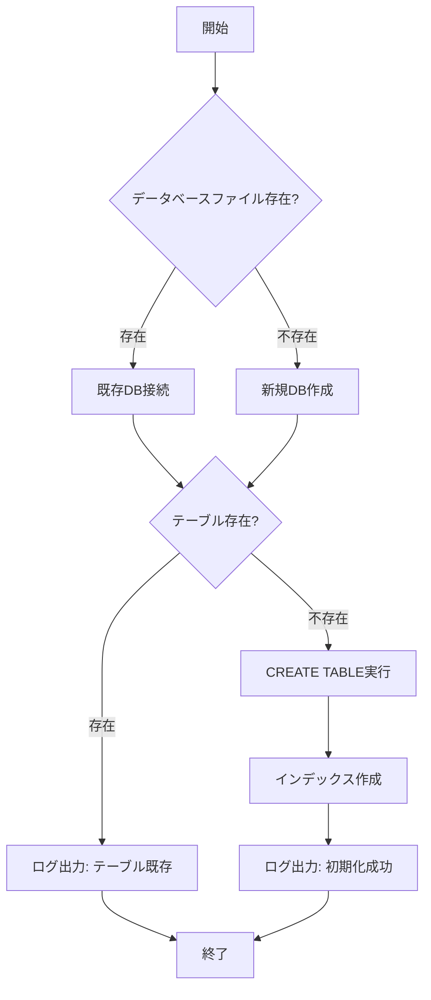

# 詳細設計書

## ドキュメント情報

| 項目 | 内容 |
|-----|------|
| ドキュメント名 | 社員情報管理システム 詳細設計書 |
| 版数 | 1.0 |
| 作成日 | 2026-03-22 |
| 対象システム | 社員情報管理システム（Python学習用） |

**注記**: 本ドキュメントでは D-01～D-04, D-10 を記載。D-05～D-09 は「詳細設計書_続き.md」を参照。

---

## D-01: データベース初期化機能

### 概要
SQLiteデータベースとemployeesテーブルを初期化する機能

### クラス名
`DatabaseManager`

### ファイルパス
`database/database_manager.py`

### 処理フロー



### 実装コード例

```python
# database/database_manager.py
import sqlite3
import logging
from pathlib import Path

class DatabaseManager:
    """データベース管理クラス"""
    
    def __init__(self, db_path):
        """
        コンストラクタ
        
        Args:
            db_path (str): データベースファイルパス
        """
        self.db_path = db_path
        self.logger = logging.getLogger(__name__)
        
    def initialize_database(self):
        """
        データベースとテーブルを初期化
        
        Returns:
            bool: 成功時True、失敗時False
        """
        try:
            # データベースディレクトリが存在しない場合は作成
            db_dir = Path(self.db_path).parent
            db_dir.mkdir(parents=True, exist_ok=True)
            
            # データベース接続
            conn = sqlite3.connect(self.db_path)
            cursor = conn.cursor()
            
            # テーブル作成SQL
            create_table_sql = """
            CREATE TABLE IF NOT EXISTS employees (
                employee_id TEXT PRIMARY KEY,
                name TEXT NOT NULL,
                name_kana TEXT NOT NULL,
                department TEXT NOT NULL,
                position TEXT NOT NULL,
                hire_date TEXT NOT NULL,
                salary INTEGER NOT NULL,
                email TEXT NOT NULL UNIQUE,
                phone TEXT,
                postal_code TEXT,
                address TEXT,
                notes TEXT,
                created_at TEXT NOT NULL DEFAULT CURRENT_TIMESTAMP,
                updated_at TEXT NOT NULL DEFAULT CURRENT_TIMESTAMP
            )
            """
            
            cursor.execute(create_table_sql)
            
            # インデックス作成
            index_sqls = [
                "CREATE INDEX IF NOT EXISTS idx_employee_name ON employees(name)",
                "CREATE INDEX IF NOT EXISTS idx_employee_department ON employees(department)",
                "CREATE INDEX IF NOT EXISTS idx_employee_hire_date ON employees(hire_date)"
            ]
            
            for index_sql in index_sqls:
                cursor.execute(index_sql)
            
            conn.commit()
            conn.close()
            
            self.logger.info(f"Database initialized successfully: {self.db_path}")
            return True
            
        except sqlite3.Error as e:
            self.logger.error(f"Database initialization failed: {e}")
            return False
    
    def get_connection(self):
        """
        データベース接続を取得
        
        Returns:
            sqlite3.Connection: データベース接続オブジェクト
        """
        try:
            conn = sqlite3.connect(self.db_path)
            conn.row_factory = sqlite3.Row  # 辞書形式で取得
            return conn
        except sqlite3.Error as e:
            self.logger.error(f"Database connection failed: {e}")
            raise
```
```python
# 動作確認用テストブロック
if __name__ == '__main__':
    import logging
    logging.basicConfig(level=logging.DEBUG)
    from config import Config

    db_manager = DatabaseManager(Config.DATABASE_PATH)
    success = db_manager.initialize_database()

    if success:
        print("✓ データベース初期化成功")
        conn = db_manager.get_connection()
        cursor = conn.cursor()
        cursor.execute("SELECT name FROM sqlite_master WHERE type='table'")
        tables = cursor.fetchall()
        print(f"テーブル一覧: {[dict(t)['name'] for t in tables]}")
        conn.close()
    else:
        print("✗ データベース初期化失敗")
```

> **補足**: `if __name__ == '__main__':` ブロックは直接実行時のみ動作します。
> 動作確認コマンド `python3 -m database.database_manager` でデータベース初期化のテストが可能です。
> `conn.row_factory = sqlite3.Row` を設定しているため、カラム名でアクセスできます。

### save_employee() メソッド

#### 概要
CSVから読み込んだ1行分の社員データを `employees` テーブルに保存する。
同じ社員ID（PRIMARY KEY）が既に存在する場合は上書き更新（UPSERT）する。

#### 引数・戻り値

| 項目 | 内容 |
|------|------|
| 引数 `row_data` | CSVの1行データ（`dict`型）。キーはCSVヘッダー名（日本語） |
| 戻り値 | なし（`None`） |
| 例外 | `sqlite3.Error` が発生した場合は呼び出し元に再スロー |

#### CSVヘッダーとDBカラムのマッピング

| CSVヘッダー | DBカラム | 型 | 備考 |
|------------|---------|-----|------|
| 社員ID | employee_id | TEXT | PRIMARY KEY |
| 氏名 | name | TEXT | NOT NULL |
| 氏名カナ | name_kana | TEXT | NOT NULL |
| 部署 | department | TEXT | NOT NULL |
| 役職 | position | TEXT | NOT NULL |
| 入社日 | hire_date | TEXT | NOT NULL（YYYY-MM-DD形式） |
| 給与 | salary | INTEGER | NOT NULL。`int()` でキャスト |
| メールアドレス | email | TEXT | NOT NULL、UNIQUE |

#### 実装コード例

```python
def save_employee(self, row_data: dict) -> None:
    """社員データをDBに保存する（既存の場合は更新）

    Args:
        row_data (dict): CSVの1行データ。キーはCSVヘッダー名（日本語）

    Raises:
        sqlite3.Error: データベース操作に失敗した場合
    """
    sql = """
    INSERT OR REPLACE INTO employees
        (employee_id, name, name_kana, department, position,
         hire_date, salary, email, updated_at)
    VALUES
        (?, ?, ?, ?, ?, ?, ?, ?, CURRENT_TIMESTAMP)
    """
    params = (
        row_data['社員ID'],
        row_data['氏名'],
        row_data['氏名カナ'],
        row_data['部署'],
        row_data['役職'],
        row_data['入社日'],
        int(row_data['給与']),
        row_data['メールアドレス'],
    )
    conn = self.get_connection()
    try:
        cursor = conn.cursor()
        cursor.execute(sql, params)
        conn.commit()
        self.logger.info(f"社員データを保存しました: {row_data['社員ID']}")
    except sqlite3.Error as e:
        conn.rollback()
        self.logger.error(f"社員データの保存に失敗しました: {e}")
        raise
    finally:
        conn.close()
```

---

### エラーハンドリング

| エラーコード | エラー状況 | 判定基準 | 処理内容 |
|------------|----------|---------|---------|
| E001 | データベース接続失敗 | sqlite3.Errorが発生 | ログ出力、例外再スロー |
| E002 | テーブル作成失敗 | CREATE TABLE実行時にエラー | ログ出力、False返却 |
| E003 | 社員データ保存失敗 | sqlite3.Errorが発生 | ロールバック、ログ出力、例外再スロー |

### 学習ポイント

- ✅ クラス定義（class）
- ✅ コンストラクタ（\_\_init\_\_）
- ✅ with文によるリソース管理
- ✅ try-except例外処理
- ✅ logging モジュール
- ✅ sqlite3 モジュール
- ✅ pathlib による Path 操作
- ✅ 三重引用符による複数行文字列
- ✅ INSERT OR REPLACE（UPSERT）によるデータ重複対応
- ✅ パラメータ化クエリ（`?` プレースホルダー）によるSQLインジェクション防止

---

## D-02: CSVインポート機能

### 概要
CSVファイルから社員データを一括登録する機能

### クラス名
`CSVHandler`

### ファイルパス
`utils/csv_handler.py`

### 実装コード例

```python
# utils/csv_handler.py
import csv
import logging
from typing import List, Dict, Tuple

class CSVHandler:
    """CSVファイルの読み込みとデータベースへの保存を担当するクラス"""

    def __init__(self, db_manager, validator):
        self.db_manager = db_manager
        self.validator = validator
        self.logger = logging.getLogger(__name__)

        self.required_headers = [
            '社員ID', '氏名', '氏名カナ', '部署', '役職',
            '入社日', '給与', 'メールアドレス'
            ]

    def import_from_csv(self, file_path: str) -> Tuple[int, List[str]]:
        """CSVファイルを読み込み、データベースに保存する"""
        self.logger.info(f"CSVファイルのインポートを開始: {file_path}")
        success_count = 0
        error_messages = []

        try:
            with open(file_path, mode='r', encoding='utf-8') as csvfile:
                reader = csv.DictReader(csvfile)

                # ヘッダーの検証
                if not self._validate_headers(reader.fieldnames):
                    error_message = f"CSVファイルのヘッダーが不正です。必要なヘッダー: {self.required_headers}"
                    self.logger.error(error_message)
                    return success_count, [error_message]

                # データの検証と保存
                for row_data in reader:
                    validation_errors = self.validator.validate_employee_data(row_data)
                    if validation_errors:
                        error_message = f"社員ID {row_data.get('社員ID', '不明')}: " + "; ".join(validation_errors)
                        self.logger.warning(error_message)
                        error_messages.append(error_message)
                        continue

                    try:
                        self.db_manager.save_employee(row_data)
                        success_count += 1
                    except Exception as e:
                        error_message = f"社員ID {row_data.get('社員ID', '不明')}: データベースへの保存に失敗 - {str(e)}"
                        self.logger.error(error_message)
                        error_messages.append(error_message)

        except FileNotFoundError:
            error_message = f"ファイルが見つかりません: {file_path}"
            self.logger.error(error_message)
            return success_count, [error_message]
        except Exception as e:
            error_message = f"CSVファイルの読み込み中にエラーが発生: {str(e)}"
            self.logger.error(error_message)
            return success_count, [error_message]

        self.logger.info(f"CSVファイルのインポートが完了しました。成功: {success_count}, エラー: {len(error_messages)}")
        return success_count, error_messages


    def _validate_headers(self, headers) -> bool:
        """CSVヘッダーの検証"""
        if not headers:
            return False
        return all(header_row_data in headers for header_row_data in self.required_headers)
```

### 学習ポイント

- ✅ csv モジュール（DictReader）
- ✅ Type Hints（Tuple, List, Dict）
- ✅ enumerate関数
- ✅ 辞書の get メソッド

---

## D-03: バリデーション機能

### 概要
入力データの妥当性を検証する機能

### クラス名
`DataValidator`

### ファイルパス
`utils/validator.py`

### バリデーションルール

| 項目 | ルール | 正規表現 |
|-----|-------|---------|
| 社員ID | 英字1文字+数字4桁 | `^[A-Z][0-9]{4}$` |
| 氏名カナ | 全角カタカナ | `^[ァ-ヴー\s　]+$` |
| メールアドレス | 標準メール形式 | 組み込みre |
| 入社日 | YYYY-MM-DD形式 | `^\d{4}-\d{2}-\d{2}$` |

### 実装コード例

```python
# utils/validator.py
import re
from datetime import datetime
from typing import Tuple

class DataValidator:
    """データバリデーションクラス"""
    
    # 正規表現パターン
    EMPLOYEE_ID_PATTERN = re.compile(r'^[A-Z][0-9]{4}$')
    NAME_KANA_PATTERN = re.compile(r'^[ァ-ヴー\s　]+$')
    EMAIL_PATTERN = re.compile(r'^[a-zA-Z0-9._%+-]+@[a-zA-Z0-9.-]+\.[a-zA-Z]{2,}$')
    PHONE_PATTERN = re.compile(r'^[0-9-]+$')
    POSTAL_CODE_PATTERN = re.compile(r'^\d{3}-\d{4}$')
    HIRE_DATE_PATTERN = re.compile(r'^\d{4}-\d{2}-\d{2}$')
    
    # 定義済み選択肢
    VALID_DEPARTMENTS = ['営業部', '開発部', '総務部', '人事部', '経理部']
    VALID_POSITIONS = ['部長', '課長', '係長', '主任', '一般']
    
    def validate_employee_id(self, employee_id: str) -> Tuple[bool, str]:
        """社員IDのバリデーション"""
        if not employee_id:
            return False, "社員IDは必須です"
        if not self.EMPLOYEE_ID_PATTERN.match(employee_id):
            return False, "社員IDは英字1文字+数字4桁の形式です（例: A0001）"
        return True, ""
    
    def validate_name(self, name: str) -> Tuple[bool, str]:
        """氏名のバリデーション"""
        if not name or not name.strip():
            return False, "氏名は必須です"
        if len(name) > 50:
            return False, "氏名は50文字以内です"
        return True, ""
    
    def validate_email(self, email: str) -> Tuple[bool, str]:
        """メールアドレスのバリデーション"""
        if not email:
            return False, "メールアドレスは必須です"
        if len(email) > 255:
            return False, "メールアドレスは255文字以内です"
        if not self.EMAIL_PATTERN.match(email):
            return False, "正しいメールアドレス形式で入力してください"
        return True, ""
    
    def validate_hire_date(self, hire_date: str) -> Tuple[bool, str]:
        """入社日のバリデーション"""
        if not hire_date:
            return False, "入社日は必須です"
        if not self.HIRE_DATE_PATTERN.match(hire_date):
            return False, "入社日はYYYY-MM-DD形式で入力してください"
        
        try:
            date_obj = datetime.strptime(hire_date, '%Y-%m-%d')
            if date_obj.year < 1900:
                return False, "入社日は1900年以降の日付を入力してください"
            if date_obj > datetime.now():
                return False, "入社日は今日以前の日付を入力してください"
        except ValueError:
            return False, "正しい日付を入力してください"
        
        return True, ""
    
    def validate_salary(self, salary: str) -> Tuple[bool, str]:
        """給与のバリデーション"""
        if not salary:
            return False, "給与は必須です"
        try:
            salary_int = int(salary)
            if salary_int < 0:
                return False, "給与は0以上の整数です"
            if salary_int > 999999999:
                return False, "給与は999,999,999以下です"
        except ValueError:
            return False, "給与は整数で入力してください"
        return True, ""
    
    def validate_name_kana(self, name_kana: str) -> Tuple[bool, str]:
        """氏名カナのバリデーション"""
        if not name_kana or not name_kana.strip():
            return False, "氏名カナは必須です"
        if not self.NAME_KANA_PATTERN.match(name_kana):
            return False, "氏名カナは全角カタカナで入力してください"
        if len(name_kana) > 50:
            return False, "氏名カナは50文字以内です"
        return True, ""
    
    def validate_department(self, department: str) -> Tuple[bool, str]:
        """部署のバリデーション"""
        if not department:
            return False, "部署は必須です"
        if department not in self.VALID_DEPARTMENTS:
            return False, f"部署は次のいずれかを選択してください: {', '.join(self.VALID_DEPARTMENTS)}"
        return True, ""
    
    def validate_position(self, position: str) -> Tuple[bool, str]:
        """役職のバリデーション"""
        if not position:
            return False, "役職は必須です"
        if position not in self.VALID_POSITIONS:
            return False, f"役職は次のいずれかを選択してください: {', '.join(self.VALID_POSITIONS)}"
        return True, ""
    
    def validate_phone(self, phone: str) -> Tuple[bool, str]:
        """電話番号のバリデーション（オプション項目）"""
        if not phone or not phone.strip():
            return True, ""  # 空欄OK
        if not self.PHONE_PATTERN.match(phone):
            return False, "電話番号は数字とハイフンのみ入力可能です"
        if len(phone) > 20:
            return False, "電話番号は20文字以内です"
        return True, ""
    
    def validate_postal_code(self, postal_code: str) -> Tuple[bool, str]:
        """郵便番号のバリデーション（オプション項目）"""
        if not postal_code or not postal_code.strip():
            return True, ""  # 空欄OK
        if not self.POSTAL_CODE_PATTERN.match(postal_code):
            return False, "郵便番号は123-4567形式で入力してください"
        return True, ""
    
    def validate_address(self, address: str) -> Tuple[bool, str]:
        """住所のバリデーション（オプション項目）"""
        if not address or not address.strip():
            return True, ""  # 空欄OK
        if len(address) > 255:
            return False, "住所は255文字以内です"
        return True, ""
    

    def validate_notes(self, notes: str) -> Tuple[bool, str]:
        """備考のバリデーション（オプション項目）"""
        if not notes or not notes.strip():
            return True, ""  # 空欄OK
        if len(notes) > 1000:
            return False, "備考は1000文字以内です"
        return True, ""

    def validate_employee_data(self, data: dict) -> list:
        """社員データの総合バリデーション（必須8項目を一括チェック）"""
        errors = []
        checks = [
            (self.validate_employee_id,  data.get('社員ID', '')),
            (self.validate_name,         data.get('氏名', '')),
            (self.validate_name_kana,    data.get('氏名カナ', '')),
            (self.validate_department,   data.get('部署', '')),
            (self.validate_position,     data.get('役職', '')),
            (self.validate_email,        data.get('メールアドレス', '')),
            (self.validate_hire_date,    data.get('入社日', '')),
            (self.validate_salary,       data.get('給与', '')),
        ]
        for validator_func, value in checks:
            is_valid, message = validator_func(value)
            if not is_valid:
                errors.append(message)
        return errors


if __name__ == "__main__":
    # テスト実行
    validator = DataValidator()
    
    print("=== 必須項目のバリデーションテスト ===")
    # 正常ケース
    tests = [
        ("社員ID", validator.validate_employee_id, "A0001"),
        ("氏名", validator.validate_name, "山田太郎"),
        ("氏名カナ", validator.validate_name_kana, "ヤマダタロウ"),
        ("部署", validator.validate_department, "営業部"),
        ("役職", validator.validate_position, "部長"),
        ("メール", validator.validate_email, "test@example.com"),
        ("入社日", validator.validate_hire_date, "2020-01-01"),
        ("給与", validator.validate_salary, "5000000"),
    ]
    
    for label, func, value in tests:
        valid, msg = func(value)
        status = "✓" if valid else "✗"
        print(f"{status} {label}: {value} - {msg if msg else 'OK'}")
    
    print("\n=== オプション項目のバリデーションテスト ===")
    optional_tests = [
        ("電話番号", validator.validate_phone, "03-1234-5678"),
        ("郵便番号", validator.validate_postal_code, "123-4567"),
        ("住所", validator.validate_address, "東京都千代田区1-1"),
        ("備考", validator.validate_notes, "特になし"),
    ]
    
    for label, func, value in optional_tests:
        valid, msg = func(value)
        status = "✓" if valid else "✗"
        print(f"{status} {label}: {value} - {msg if msg else 'OK'}")
    
    print("\n=== エラーケースのテスト ===")
    error_tests = [
        ("社員ID不正", validator.validate_employee_id, "0001"),
        ("カナ不正", validator.validate_name_kana, "yamada"),
        ("部署不正", validator.validate_department, "不明部署"),
        ("給与負数", validator.validate_salary, "-1000"),
    ]
    
    for label, func, value in error_tests:
        valid, msg = func(value)
        status = "✓" if valid else "✗"
        print(f"{status} {label}: {value} - {msg}")
```

> **補足**: D-03 の実装コード例には全バリデーターメソッドを含みます。
> 各メソッドは `Tuple[bool, str]` を返します（`True, ""` = OK、`False, "エラーメッセージ"` = NG）。
> `if __name__ == '__main__':` ブロックでテスト実行が可能です。

### 学習ポイント

- ✅ 正規表現（re.compile, match）```

### 学習ポイント

- ✅ 正規表現（re.compile, match）
- ✅ datetime モジュール
- ✅ try-except ValueError
- ✅ Type Hints

---

## D-04: ログ出力機能

### 概要
システム動作ログを記録する機能

### ファイルパス
`utils/logger.py`

### ログレベル

| レベル | 用途 |
|-------|------|
| DEBUG | デバッグ情報 |
| INFO | 通常動作の記録 |
| WARNING | 警告 |
| ERROR | エラー |
| CRITICAL | 致命的エラー |

### 実装コード例

```python
# utils/logger.py
import logging
from logging.handlers import TimedRotatingFileHandler
import os
from config import Config

def setup_logger(name='employee_system', log_file=None, level=None):
    """ロガーのセットアップ。
    log_file と level が未指定の場合は config.py の Config クラスの値を使用。
    ログレベルは config.py の LOG_LEVEL で管理する。
    """
    if log_file is None:
        log_file = Config.LOG_FILE
    if level is None:
        level = getattr(logging, Config.LOG_LEVEL, logging.INFO)

    log_dir = os.path.dirname(log_file)
    if log_dir and not os.path.exists(log_dir):
        os.makedirs(log_dir)

    logger = logging.getLogger(name)
    logger.setLevel(level)

    if logger.hasHandlers():
        logger.handlers.clear()

    formatter = logging.Formatter(
        '[%(asctime)s] %(levelname)s in %(module)s: %(message)s',
        datefmt='%Y-%m-%d %H:%M:%S'
    )

    file_handler = TimedRotatingFileHandler(
        log_file,
        when='midnight',    # 深夜0時に切り替え
        interval=1,         # 1日ごと
        backupCount=30,     # 30日分保持
        encoding='utf-8'
    )
    file_handler.setFormatter(formatter)

    console_handler = logging.StreamHandler()
    console_handler.setFormatter(formatter)

    logger.addHandler(file_handler)
    logger.addHandler(console_handler)

    return logger
```

```python
# グローバルロガー初期化
app_logger = setup_logger()

if __name__ == "__main__":
    # テスト実行
    app_logger.debug("DEBUGメッセージ")
    app_logger.info("INFOメッセージ")
    app_logger.warning("WARNINGメッセージ")
    app_logger.error("ERRORメッセージ")
    app_logger.critical("CRITICALメッセージ")
```

> **補足**: ログレベルは `config.py` の `Config.LOG_LEVEL` で一元管理します。  
> 変更する場合は `config.py` の `LOG_LEVEL` の値を修正するか、
> 環境変数 `LOG_LEVEL=DEBUG` を設定することで切り替えられます。  
> `app_logger = setup_logger()` はモジュールとして import された際に
> グローバルなロガーインスタンスを利用できるようにするための初期化です。  
> `if __name__ == "__main__":` ブロックは直接実行時のみ動作し、
> 動作確認コマンド `python3 utils/logger.py` で出力を確認するために必要です。


### 学習ポイント

- ✅ logging モジュール
- ✅ TimedRotatingFileHandler
- ✅ os.path モジュール

---

## D-10: エラーハンドリング統合設計

### エラーコード一覧

| コード | エラー内容 | レベル | 対応 |
|-------|----------|-------|-----|
| E001 | データベース接続失敗 | CRITICAL | ログ出力 + 例外スロー |
| E002 | テーブル作成失敗 | CRITICAL | ログ出力 + False返却 |
| E003 | CSVファイル読み込み失敗 | ERROR | ログ出力 + エラーメッセージ |
| E004 | バリデーションエラー | WARNING | エラーメッセージ返却 |
| E005 | 社員ID重複 | ERROR | ログ出力 + エラー画面 |
| E006 | メールアドレス重複 | ERROR | ログ出力 + エラー画面 |
| E007 | 存在しない社員ID | ERROR | ログ出力 + 404画面 |

### カスタム例外クラス

```python
# utils/exceptions.py

class EmployeeSystemException(Exception):
    """システム共通の基底例外クラス"""
    def __init__(self, message, error_code=None):
        self.message = message
        self.error_code = error_code
        super().__init__(self.message)

class DatabaseException(EmployeeSystemException):
    """データベース関連の例外"""
    pass

class ValidationException(EmployeeSystemException):
    """バリデーション関連の例外"""
    pass

class NotFoundException(EmployeeSystemException):
    """データ不存在の例外"""
    pass
```

### Flaskエラーハンドラ例

```python
# app.py に追記するエラーハンドラ
@app.errorhandler(404)
def not_found(error):
    return render_template('errors/404.html'), 404

@app.errorhandler(500)
def internal_error(error):
    logger.error(f"Internal server error: {error}")
    return render_template('errors/500.html'), 500
```

> **補足**: エラーハンドラは `app.py` に追記します。
> テンプレートは `templates/errors/404.html` と `templates/errors/500.html` を作成してください。
> `logger` は `utils.logger` の `setup_logger()` で取得したインスタンスを使用します。

### 学習ポイント

- ✅ カスタム例外クラス
- ✅ 継承（Exception継承）
- ✅ super()関数
- ✅ 例外のraise

---


---

## D-01-B: SQLAlchemy ORM による実装（移行ガイド）

### 概要

D-01 では `sqlite3` モジュールを直接使用し、SQL文をコード内にハードコードしていました。
本セクションでは、Python の業界標準 ORM ライブラリである **SQLAlchemy** を使用した実装へ移行する方法を説明します。

**移行のメリット**:
- SQL文をコードに書かず、Pythonクラスでテーブル定義を管理できる
- パラメータバインディングが自動化され、SQLインジェクション対策が強化される
- SQLite → PostgreSQL など、DBエンジンの変更が容易になる

---

### インストール

```bash
pip install sqlalchemy
pip freeze > requirements.txt
```

---

### 新規ファイル: `database/models.py`

テーブル定義をPythonクラスとして記述します。

```python
# database/models.py
from sqlalchemy import Column, Integer, String, Text, Index
from sqlalchemy.orm import DeclarativeBase
from sqlalchemy.sql import func


class Base(DeclarativeBase):
    """全モデルの基底クラス"""
    pass


class Employee(Base):
    """社員テーブルモデル"""
    __tablename__ = "employees"

    employee_id = Column(String, primary_key=True)
    name        = Column(String, nullable=False)
    name_kana   = Column(String, nullable=False)
    department  = Column(String, nullable=False)
    position    = Column(String, nullable=False)
    hire_date   = Column(String, nullable=False)
    salary      = Column(Integer, nullable=False)
    email       = Column(String, nullable=False, unique=True)
    phone       = Column(String)
    postal_code = Column(String)
    address     = Column(Text)
    notes       = Column(Text)
    created_at  = Column(String, nullable=False, server_default=func.current_timestamp())
    updated_at  = Column(String, nullable=False, server_default=func.current_timestamp())

    __table_args__ = (
        Index("idx_employees_name", "name"),
        Index("idx_employees_department", "department"),
        Index("idx_employees_hire_date", "hire_date"),
    )
```

> **補足**: `__table_args__` にインデックスを定義することで、`Base.metadata.create_all()` 実行時に
> テーブルとインデックスが同時に作成されます。SQL文を一行も書く必要はありません。

---

### 変更後: `database/database_manager.py`

`sqlite3` の直接操作を SQLAlchemy に置き換えます。

```python
# database/database_manager.py（SQLAlchemy版）
import logging
from pathlib import Path
from sqlalchemy import create_engine
from sqlalchemy.orm import sessionmaker, Session
from database.models import Base


class DatabaseManager:
    """データベース管理クラス（SQLAlchemy版）"""

    def __init__(self, db_path: str):
        self.db_path = db_path
        self.logger = logging.getLogger(__name__)
        self._engine = None
        self._SessionFactory = None

    def initialize_database(self) -> bool:
        """データベースとテーブルを初期化

        Returns:
            bool: 成功時にTrue、失敗時にFalse
        """
        try:
            db_dir = Path(self.db_path).parent
            db_dir.mkdir(parents=True, exist_ok=True)

            # エンジン作成（sqlite:///は相対パス、sqlite:////は絶対パス）
            self._engine = create_engine(f"sqlite:///{self.db_path}", echo=False)

            # モデル定義からテーブル・インデックスを自動生成（CREATE TABLE IF NOT EXISTS相当）
            Base.metadata.create_all(self._engine)

            self._SessionFactory = sessionmaker(bind=self._engine)

            self.logger.info(f"Database initialized successfully: {self.db_path}")
            return True

        except Exception as e:
            self.logger.error(f"Database initialization failed: {e}")
            return False

    def get_session(self) -> Session:
        """DBセッションを取得（with文で使用すること）

        Returns:
            Session: SQLAlchemyセッションオブジェクト

        Example:
            with db_manager.get_session() as session:
                employees = session.query(Employee).all()
        """
        if self._SessionFactory is None:
            raise RuntimeError("initialize_database() を先に呼び出してください")
        return self._SessionFactory()
```

---

### CRUD操作の書き方比較

#### sqlite3（移行前）

```python
conn = db_manager.get_connection()
cursor = conn.cursor()

# 登録
cursor.execute(
    "INSERT INTO employees (employee_id, name, ...) VALUES (?, ?, ...)",
    ("A0001", "山田太郎", ...)
)
conn.commit()

# 検索
cursor.execute("SELECT * FROM employees WHERE department = ?", ("営業部",))
rows = cursor.fetchall()
conn.close()
```

#### SQLAlchemy ORM（移行後）

```python
from database.models import Employee

# セッションはwith文で使用するとcommit/rollback/closeが自動管理される
with db_manager.get_session() as session:

    # 登録
    emp = Employee(employee_id="A0001", name="山田太郎", department="営業部", ...)
    session.add(emp)
    session.commit()

    # 1件取得（主キー検索）
    emp = session.get(Employee, "A0001")

    # 全件取得
    employees = session.query(Employee).all()

    # 条件検索（WHERE department = '営業部'）
    results = session.query(Employee).filter(Employee.department == "営業部").all()

    # 複数条件検索
    results = session.query(Employee).filter(
        Employee.department == "営業部",
        Employee.salary >= 5000000
    ).all()

    # 更新
    emp = session.get(Employee, "A0001")
    emp.salary = 9000000
    session.commit()

    # 削除
    emp = session.get(Employee, "A0001")
    session.delete(emp)
    session.commit()
```

> **補足**: `session.query(Employee).all()` の戻り値は `Employee` オブジェクトのリストです。
> 各カラムへのアクセスは `emp.name`、`emp.department` のようにドット記法で行います。

---

### 動作確認

```bash
# SQLAlchemyインストール確認
python3 -c "import sqlalchemy; print(sqlalchemy.__version__)"

# データベース初期化テスト
python3 -m database.database_manager

# テーブル・インデックス確認
sqlite3 database/employees.db << 'EOF'
.schema employees
.indexes employees
.quit
EOF
```

### 学習ポイント

- ✅ SQLAlchemy の `DeclarativeBase` によるモデル定義
- ✅ `create_engine()` による接続設定
- ✅ `Base.metadata.create_all()` による自動DDL実行
- ✅ `sessionmaker` と `Session` によるトランザクション管理
- ✅ with文によるセッションのライフサイクル管理
- ✅ ORM を使ったCRUD操作（SQL文不要）

---

## 変更履歴

| 版数 | 日付 | 変更内容 | 作成者 |
|-----|------|---------|-------|
| 1.0 | 2026-03-22 | 初版作成 | - |
| 1.1 | 2026-03-26 | D-01-B: SQLAlchemy ORM移行ガイド追加 | - |
